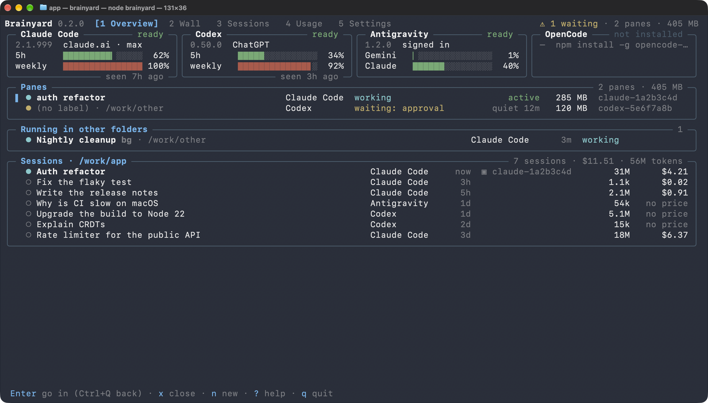
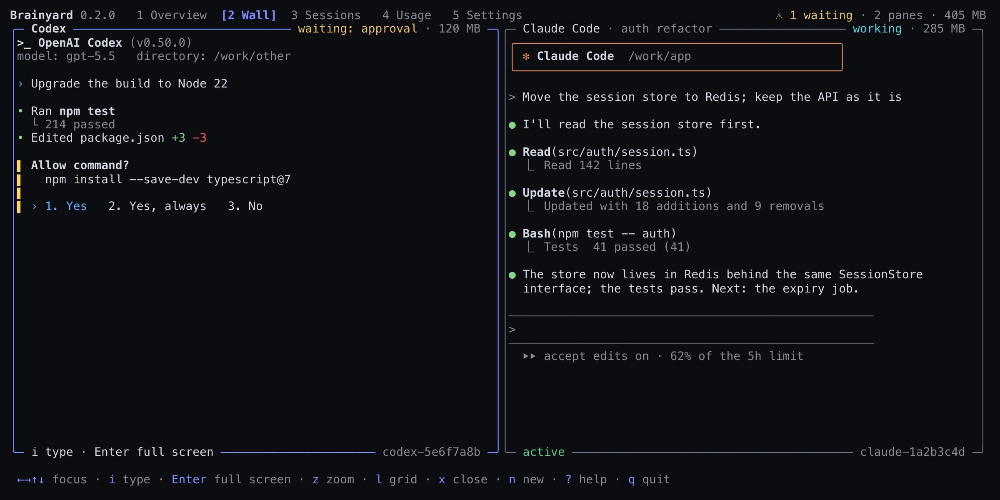
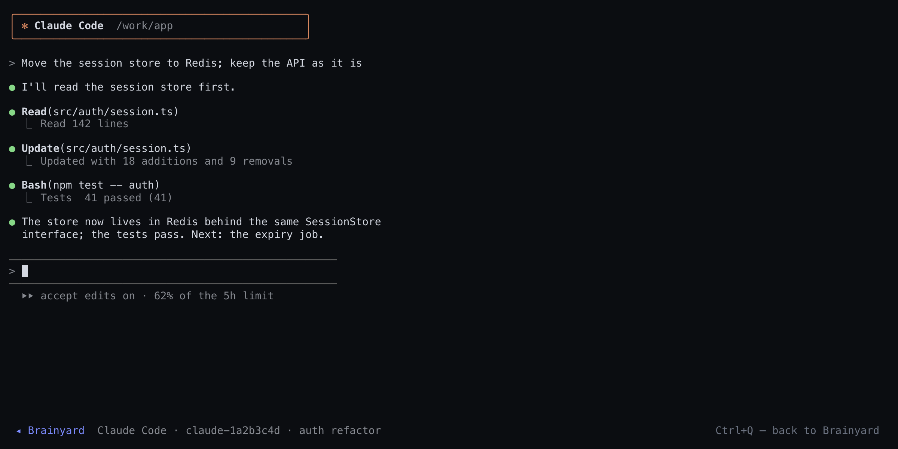
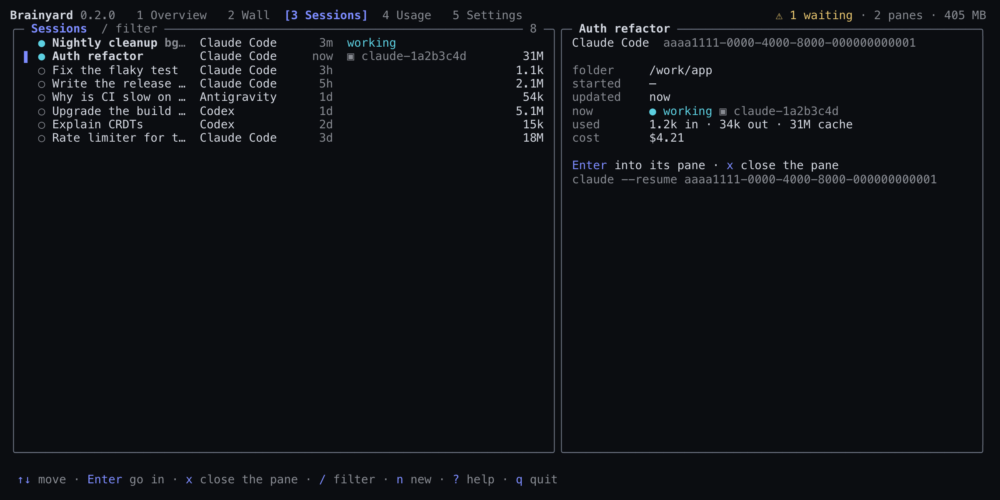
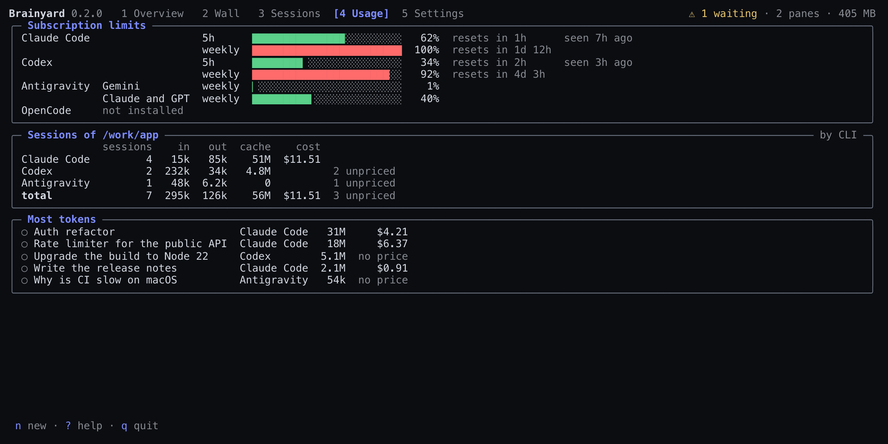
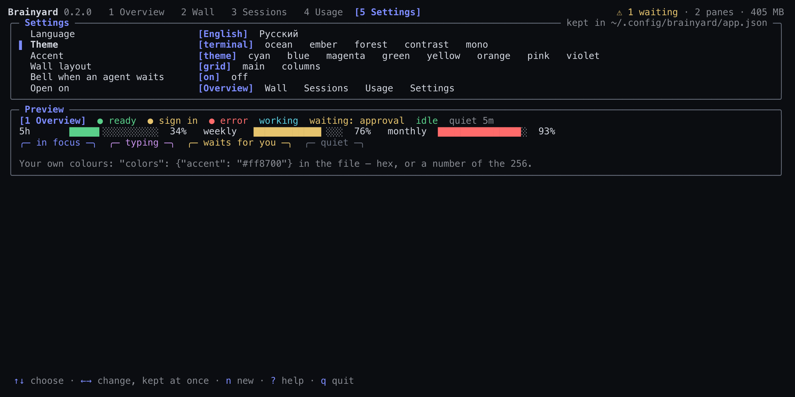
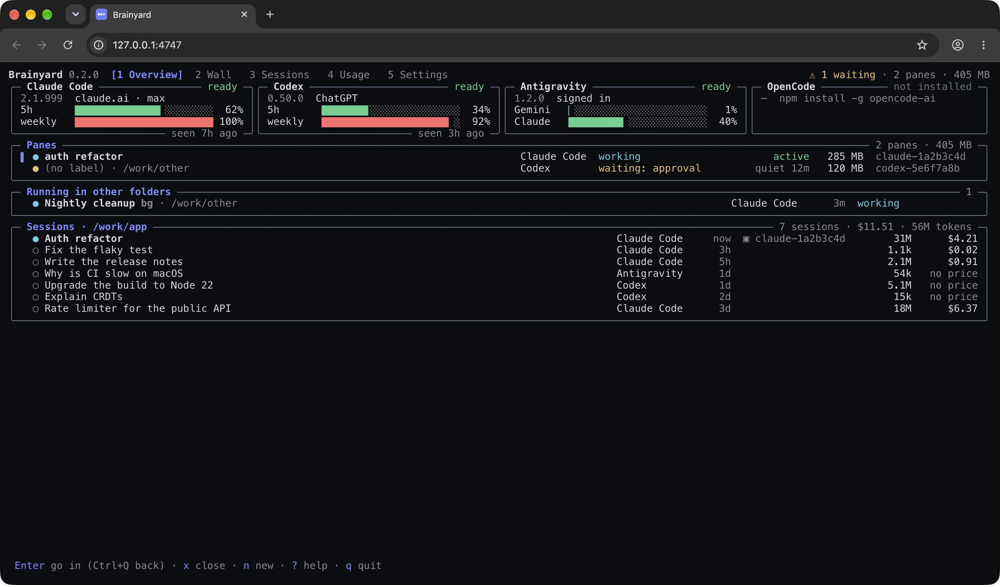

<div align="center">


# Brainyard

**One interface to the coding agents you already have: Claude Code, Codex, Antigravity and OpenCode.**

An app to watch and drive them, in a terminal or in a browser, and an API to drive them from
your own program: status and subscription limits, one-shot answers, runs with a live feed,
sessions you come back to, and CLI sessions in tmux panes that outlive whatever started them.

[](https://github.com/antondanv/brainyard/actions/workflows/ci.yml)
[](https://www.npmjs.com/package/@antondanv/brainyard)


[](LICENSE)

**English** · [Русский](README.ru.md)



</div>

## Two packages

| Package | What is in it | For |
|---|---|---|
| `@antondanv/brainyard-cli` | The full one: the `brainyard` command — the app in a terminal, `brainyard web` in a browser, commands for scripts and a local HTTP API | You, at the keyboard |
| `@antondanv/brainyard` | The light one: the API alone, with no runtime dependencies — status, asks, runs, sessions, panes, usage | Your program |

```sh
npm install -g @antondanv/brainyard-cli    # the app, the browser, the commands
npm install @antondanv/brainyard           # the API for your program
```

The command is built on the API, so both say and do the same. You need Node.js 22+ and at least
one agent CLI:

| CLI | Install | Sign in |
|---|---|---|
| Claude Code | `npm install -g @anthropic-ai/claude-code` | run `claude` once |
| Codex | `npm install -g @openai/codex` | `codex login` |
| Antigravity | `curl -fsSL https://antigravity.google/cli/install.sh \| bash` | run `agy` once |
| OpenCode | `npm install -g opencode-ai` | `opencode auth login` for a provider (its free models need none) |

## Why

Claude Code, Codex, Antigravity and OpenCode are excellent agents, and each speaks its own
dialect: its own flags, stream format and way to resume a session, pass an MCP server, pick an
effort or report a usage limit. Each also has quirks that only show up in real runs: a prompt
starting with `---` read as a command-line option, a CLI that never exits because its stdin is
still open, a turn that ends silently after a refused tool.

Brainyard gives them one face. For you, one app shows every agent, what is left of its
subscription, its sessions and its live panes. For your program, one API has the same options,
events and errors for all four, with the workarounds built in. It drives the CLIs you installed,
with your own accounts: it runs no service, calls no model API and holds no keys.

It was extracted from a production system that runs these CLIs every day. Most of what follows
exists because a real run failed without it ([battle-tested quirks](docs/gotchas.md)).

## The app

`brainyard` in a terminal is one full-screen app; piped or in a script it prints the status
table instead. A card for each agent shows its sign-in and its subscription limits as bars
(Claude Code's are the ones its own `/usage` fetched last); then the panes, with what each CLI
does, its memory and how long it has been quiet; sessions running in other folders; and this
folder's sessions with their tokens and cost. It keeps reading all of it while it is open and
makes no paid call of its own. It speaks English or Russian.

Enter goes into the selected pane, full screen, and Ctrl+Q comes back; on an agent Enter starts
a new pane of it, on a saved session it continues the session in a pane. `n` starts a new pane
in this folder (choose the CLI), `x` closes a pane (what was said in it stays), `s` stops a
Claude Code background session, `r` continues a saved session, Tab jumps between sections, `?`
lists the keys and `q` quits; the panes keep running. Russian keyboard letters work by their
place on the keyboard.

Digits 1–5 (or `[` `]`) open its pages. **Wall** — the live screens of several panes side by
side, the way a tiling compositor shows windows: a grid, one main tile and a stack, or columns
(`l`). Arrows move the focus, `z` zooms the tile, `i` types into it (every key, Ctrl+C included,
goes to its CLI until Ctrl+Q), Enter takes it full screen and `n` starts a new tile to type
into. Each pane is made the size of its tile. A tile turns yellow while its agent waits for
you; the header counts who waits, and the terminal rings when someone starts to.



<table>
<tr>
<td width="50%"><br><b>A pane</b>, full screen: every key goes to its CLI; Ctrl+Q — back.</td>
<td width="50%"><br><b>Sessions</b> — what runs elsewhere and this folder's sessions; <code>/</code> filters; a card with the tokens and the command that continues the session in its own CLI.</td>
</tr>
<tr>
<td width="50%"><br><b>Usage</b> — every subscription window as a bar, the folder's tokens and cost by CLI, the sessions that used the most.</td>
<td width="50%"><br><b>Settings</b> — language, theme, accent, the wall's layout, the bell and the first page, kept in <code>~/.config/brainyard/app.json</code>, where <code>"colors"</code> takes your own.</td>
</tr>
</table>

In a terminal the app leaves the mouse to it, so selecting and copying text works anywhere. The
pictures are of `npm run demo`, the app on a made-up machine.

### In a browser

`brainyard web` opens the same app in a browser on this machine. The server draws the frames a
terminal would show and the page paints them cell for cell, so the pages, the wall, the
dialogs, the theme and the language are the same.



Keys work as in the terminal. A click opens a tab, selects a row, focuses a tile or picks a
setting; a double click is Enter; the wheel moves the selection; dragging selects text to copy.
Enter on a pane shows its CLI full screen, with every key going to it and the wheel scrolling
back through what it printed, until Ctrl+Q or a click on the bar below. `q` quits the app and
the command with it; the panes keep running.

The same server has the dashboard at `/dashboard` (`brainyard ui` serves it alone): a status
card for each CLI and a playground to ask a question or run an agent with a live feed, hints,
stop and "continue this session".


Both listen on `127.0.0.1` behind the same token, `Host` and `Origin` guard as the
[HTTP API](#http-api), which stays under `/api/`.

## Command line

**Status.** Piped or in a script, `brainyard` prints this table, as `brainyard status` does:

```console
$ brainyard status
Brainyard 0.2.0

  ● Claude Code  2.1.280   ready         signed in with claude.ai, pro
  ● Codex        0.153.4   ready         signed in with ChatGPT · default model gpt-6-astra
  ● Antigravity  1.2.13    ready         signed in · model list fetched with your account
  ● OpenCode     1.18.34   ready         signed in with opencode, sber · default model sber/GigaChat-3-Pro

  4 of 4 ready · 3.6s · prove each with a real call: brainyard status --live
```

**Ask.** The answer goes to stdout and the details to stderr, so pipes work as they look:

```console
$ git diff | brainyard ask claude --model haiku "Review this diff in three bullets"
$ brainyard ask codex --effort high "Explain CRDTs in two sentences" > crdt.md
$ brainyard ask all "In one short sentence: what is a monad?"
── Claude Code claude-opus-5-5 · 4.8s · $0.0079
A monad is a type that wraps values in a context, like optionality, lists, I/O, or state, …

── Codex gpt-6-astra · 9.1s
A monad is a programming abstraction that chains computations while managing context, …

── Antigravity 13.9s
A monad is a design pattern that wraps values in a computational context and enables …
```

**Run an agent.** The feed streams to stderr. While it works, type a message and press Enter
to steer it; Ctrl+C stops it and keeps whatever it already wrote.

```console
$ brainyard run claude --model haiku --cwd ./sandbox "Write fib.py, run it, tell me the output"
Claude Code is working · type a message + Enter to steer, Ctrl+C to stop
00:01 ◆ Claude Code started · claude-haiku-4-5-20251001
00:05 › I'll create a Fibonacci script and run it for you.
00:06 ✎ wrote fib.py
00:09 $ ran: python3 fib.py
00:11 › Done! The output is: 0 1 1 2 3 5 8 13 21 34
00:11 ✓ done in 11.6s · 2 actions · $0.0306

session 32a4caae-… · continue: brainyard run claude --resume 32a4caae-… "…"
```

`--json` prints every event as a JSON line; `--quiet` prints only the answer. Like `codex exec`,
`ask` and `run` read piped stdin and append it to the prompt; that waits for end of input, so a
script that leaves stdin open should pass `--no-stdin`.

**Sessions and panes.** `sessions --live` shows what runs on the machine right now, in every
CLI, and what it waits for. A pane is a CLI session in tmux that outlives the terminal: start
it, read its screen, type into it, take it full screen and close it; the conversation stays
resumable. A pane is named by its name or the start of its name or session id. Text selected
with the mouse in a full-screen pane goes to the system clipboard (`pbcopy`, `wl-copy`, `xclip`
or `xsel`; `BRAINYARD_COPY_COMMAND` names another).

```console
$ brainyard sessions --live
Claude Code  2dcf2506  24m      ~/Projects/Brainyard  CLI for the whole API ● working ▣ claude-a6d7c603
Claude Code  381a87e4  21h      ~/Projects/shop       Retry failed payments bg ● blocked

$ pane=$(brainyard pane start claude --name "release notes" "Draft the 0.2 release notes")
$ brainyard pane send $pane "Shorter, please"   # the text, then Enter as a key of its own
$ brainyard pane show $pane                     # its screen as text
$ brainyard pane attach $pane                   # full screen; Ctrl+Q — back, it keeps running
$ brainyard pane close $pane
closed claude-1a2b3c4d · resume: brainyard pane start claude --resume 7c919bf9-…
```

**Usage.** What each subscription has left, and what the folder's sessions used. No model is
called unless you pass `--live`; `--prices` turns tokens into dollars.

```console
$ brainyard usage
Subscription limits
  Claude Code  5h reset since seen   weekly 100% · resets in 1d 12h   seen 7h ago
  Codex        5h 52% · resets in 2h 36m   weekly 32% · resets in 5d 11h   seen 35m ago
  Antigravity  Gemini Models: weekly 1% · resets in 3d 21h   5h 0% · resets in 1h 27m
               Claude and GPT models: weekly 4% · resets in 3d 21h   5h 2% · resets in 2h 50m
  OpenCode     Connect OpenCode Go in OpenCode or provide OPENCODE_API_KEY to read subscription usage.

Sessions of ~/Projects/Brainyard
                                                     input  output  cache  reasoning      cost
  Claude Code  2dcf2506  now  CLI for the whole API    226    207k    31M       117k  no price
  Codex        01a10742  35m  Usage in the API        825k    122k    17M        58k  no price
  total                       2 sessions              825k    329k    48M       175k            + 2 without a price
```

| Command | What it does |
|---|---|
| `brainyard` | The app, full screen: agents and their limits, panes, sessions, usage; piped — the status |
| `brainyard status` | Which CLIs are installed, signed in and ready (`--live`, `--models`, `--json`) |
| `brainyard models [brain…]` | Models and efforts each CLI offers |
| `brainyard ask <brain\|all> <prompt>` | One prompt, one answer (`--model`, `--effort`, `--system`, `--web`) |
| `brainyard run <brain> <prompt>` | An agent with a live feed (`--cwd`, `--resume`, `--access`, `--mcp`, `--no-web`, `--json`) |
| `brainyard sessions [brain…]` | Sessions of this folder, running ones marked; `--live` — what runs on the machine now (`--all`, `--cwd`, `--json`) |
| `brainyard stop <session>` | Stops a Claude Code background session; its conversation stays |
| `brainyard open <brain> [prompt]` | A CLI here, as a session you come back to (`--resume`, `--name`, `--bg`) |
| `brainyard panes` | Live panes: CLI, session, memory, quiet time, folder (`--json`) |
| `brainyard pane start\|attach\|show\|send\|close` | A CLI session in a tmux pane that outlives the terminal |
| `brainyard usage [brain…]` | Subscription limits; tokens and cost of this folder's sessions (`--limits`, `--prices`, `--offline`, `--live`) |
| `brainyard web` | The app in a browser, on `http://127.0.0.1:4747` (`--port`, `--no-open`) |
| `brainyard ui` | The dashboard on `http://127.0.0.1:4747` |
| `brainyard serve` | The HTTP API alone, for scripts in any language (`--json`, `$BRAINYARD_TOKEN`) |

Brains are `claude`, `codex`, `antigravity` (alias `agy`) and `opencode`. `brainyard help` lists every flag.

## Library

`@antondanv/brainyard` is what the app is built on, and all it does is a function your program
can call. Each takes a `brain` — `claude`, `codex`, `antigravity` or `opencode` — and the same
options for all four.

### Status and one-shot answers

```ts
import { ask, status } from '@antondanv/brainyard';

// Who is ready? Free checks; `live: true` adds a one-word call to each.
const { ready } = await status(); // ['claude', 'codex', 'antigravity', 'opencode']

// One prompt, one answer.
const { text, costUsd } = await ask('codex', 'One-line summary of RFC 9110?', { effort: 'low' });
```

`ask()` runs in a fresh temporary folder, read-only and without your project's `CLAUDE.md`,
hooks or MCP servers, and throws a `BrainyardError` with a `kind` on any failure.

### An agent in a folder

```ts
import { run, start } from '@antondanv/brainyard';

const agent = start({
  brain: 'claude',
  cwd: './app',
  prompt: 'Add a unit test for src/math.ts and make it pass',
  access: 'workspace', // edits and commands inside ./app only
});

for await (const event of agent) {
  if (event.feed) console.log(event.summary); // "wrote test/math.test.ts", "ran: npm test", …
  if (event.kind === 'command' && event.summary.includes('npm test')) {
    agent.hint('Use vitest, not jest.'); // reaches the agent while it works
  }
}

const result = await agent.result;
if (!result.ok) console.error(result.error); // { kind: 'usage_limit', resetsAt: '6:50pm', … }

// Continue the same conversation later.
await run({ brain: 'claude', cwd: './app', resume: result.sessionId, prompt: 'Now add a benchmark' });
```

`hint()` reaches Claude Code, Antigravity and OpenCode while they work; `stop()` stops the
agent and everything it started. `result` rejects only when the run never started (bad options,
CLI not installed); once the CLI has started, it resolves: check `result.ok`. MCP servers for
one run go in one shape, delivered the way each CLI needs them, with no global config touched:

```ts
await run({
  brain: 'codex',
  prompt: 'Which markdown file in the docs is the longest? Summarise it.',
  mcpServers: {
    files: { command: 'npx', args: ['-y', '@modelcontextprotocol/server-filesystem', './docs'] },
  },
});
```

More in [`examples/`](examples).

### Sessions you come back to

```ts
import { liveSessions, open, sessions } from '@antondanv/brainyard';

// This folder's sessions in every CLI, newest first; a running one has `live`.
for (const session of await sessions({ cwd: './app' })) {
  console.log(session.brain, session.id, session.title, session.live?.status);
}

// What runs on the machine right now, and who waits for you.
const waiting = (await liveSessions()).filter((session) => session.live?.status === 'waiting');

// The CLI itself in this terminal, until the person leaves it; then the way back in.
const { sessionId } = await open({ brain: 'claude', cwd: './app', name: 'review', prompt: 'Review the open PR' });
await open({ brain: 'claude', cwd: './app', resume: sessionId });
```

`sessions()` lists what the CLI's own picker lists: headless runs stay out unless
`headless: true`. `liveSessions()` reads each CLI's current turn: `busy`, `waiting` (and what
for) or `idle`. Recent Codex versions leave their approval dialogs out of the rollout, so
`liveSessions({ panes: {} })` also reads the dialogs on screen in Brainyard's panes.
`open({ background: true })` starts a Claude Code background session, and
`stopSession({ brain: 'claude', sessionId, cwd })` stops it with `claude stop`; the
conversation stays and can be opened again.

### Panes

```ts
import { capturePane, closePane, listPanes, sendToPane, startPane } from '@antondanv/brainyard';

// A CLI session in tmux: it keeps running when this program exits.
const { pane } = await startPane({ brain: 'claude', cwd: './app', label: 'flaky test', prompt: 'Fix the flaky test' });

const screen = await capturePane(pane); // its rows with their colours, the cursor, the size
await sendToPane(pane, 'Run it ten times first');
await sendToPane(pane, '\r'); // Enter as a key of its own, as a person presses it

for (const each of await listPanes()) console.log(each.pane, each.brain, each.label, each.activityAt);

await closePane(pane); // the CLI ends; its conversation can be resumed
```

Panes live on a tmux server of their own (`tmux -L brainyard`), so they outlive the terminal,
the app and your program, and the app, `brainyard pane …` and your program all see the same
ones. `attachPane(pane)` shows a pane full screen in this terminal until Ctrl+Q;
`resizePane()` fits it to your view; `findPaneSession()` finds the session a Codex,
Antigravity or OpenCode pane started (Claude Code's is known at once); `panesAvailable()` says
whether tmux is there.

### Usage and subscription limits

```ts
import { usage } from '@antondanv/brainyard';

const report = await usage({ cwd: './app', prices }); // your dollars per million tokens, per model
for (const session of report.sessions) console.log(session.brain, session.id, session.usage, session.costUsd);
for (const brain of report.brains) console.log(brain.brain, brain.limits, brain.limitsObservedAt);

const limitsOnly = await usage({ limit: 0 }); // the account's windows, no sessions
```

`usage()` reads the saved sessions of `cwd` (the current folder by default) in all four CLIs,
and the windows of each subscription:

| CLI | Tokens and cost of saved sessions | Subscription limits |
|---|---|---|
| Claude Code | Whole transcript, counted once per message id; estimate from `prices` | What Claude Code itself fetched last (its `/usage`), kept in `~/.claude.json`; `rate_limit_event` with `live: true` |
| Codex | Last cumulative rollout total; cost by each turn's model | Freshest rollout snapshots across the account's store |
| Antigravity | Generation metadata in `conversations/<id>.db`; estimate from `prices` | `agy -p /usage --output-format json`: weekly and five-hour quotas by model group |
| OpenCode | Assistant messages in `opencode.db`, or retained session totals; reported cost or estimate from `prices` | OpenCode Go API: rolling, weekly and monthly windows |

- **No model is called** unless you pass `live: true`: one minimal, isolated Claude call with a
  30-second timeout, which can cost money. Antigravity and OpenCode Go answer metadata requests
  without a turn; `offline: true` skips those too and reads the stores only.
- **Options.** `brains` picks the CLIs, `sessionId` one session, `limit` the sessions per CLI
  (200 by default, `0` for the limits alone), `limits: false` the sessions alone (every
  window comes back `not_requested`), `headless: true` adds headless runs, `homes` other stores.
- **Windows** carry `utilization` as a fraction (`0.95` is 95%), `windowMinutes`, `resetsAt` in
  Unix seconds, a `limitId` per quota bucket and, for Antigravity and Claude Code's per-model
  windows, `group` and `label`. Their source and the time they were seen come along: an old
  snapshot is not a live check, and a window whose reset has passed says nothing about now.
- **Claude Code's windows** are read for free from its global file (`~/.claude.json`, or the
  one in `CLAUDE_CONFIG_DIR`); a cache of another account than the one signed in is left out
  (`limitsUnavailable: 'other_account'`).
- **OpenCode Go** takes `OPENCODE_GO_API_KEY` or `OPENCODE_API_KEY`, then the keys for
  `opencode-go`/`opencode` in its `auth.json` (or `OPENCODE_AUTH_CONTENT`); an `apiKey` in
  OpenCode's config wins over a stored one. Antigravity needs a signed-in CLI 1.1.11 or later
  and runs `/usage` in a private empty folder.
- **Nothing is passed off as zero.** Data that cannot be read is `null` with a reason
  (`unavailableReason`, `limitsUnavailable`, `detail`); a total that cannot be priced is
  `null`. `byModel` splits each session by model. Estimates describe model usage, not what the
  subscription costs.

### Reference

The options of `start()`, `run()` and `ask()`, what `access` means in each CLI, the events, and what
each CLI can do.

#### Options

| Option | Default | |
|---|---|---|
| `brain` | | `claude`, `codex`, `antigravity` or `opencode` |
| `prompt` | | Sent on stdin, never as an argument |
| `cwd` | `process.cwd()` | Where the agent works (`ask()`: a fresh temporary folder) |
| `model`, `effort` | the CLI's | Checked against the CLI's catalog before the run |
| `resume` | | A `sessionId` from an earlier result |
| `access` | `full` (`ask()`: `readonly`) | See below |
| `web`, `shell` | `true` (`ask()`: no web) | Switches, where the CLI has them |
| `mcpServers` | | `{ name: { command, args?, env? } }` |
| `steerable` | where supported | Keep stdin open for `hint()` |
| `nudge` | `true` | A turn that ends without text gets one follow-up in the same conversation |
| `timeoutMs` | none | A run killed halfway is paid for in full, so there is no default limit |
| `signal`, `onEvent`, `env`, `extraArgs`, `command`, `prices`, `includeRaw` | | |

#### Access levels

A headless agent has nobody to ask for permission, so a tool that needs approval is simply
refused. Pick the level up front:

| `access` | Claude Code | Codex | Antigravity | OpenCode |
|---|---|---|---|---|
| `full` | every tool, no prompts | every tool, no sandbox | every tool, no prompts | every tool; `--auto` approves paths outside `cwd` |
| `workspace` | edits and commands in its sandbox, confined to `cwd` | `workspace-write` sandbox | edits; its sandbox refuses most commands | edits inside `cwd`; no shell, since it has no sandbox |
| `readonly` | reads and searches only | `read-only` sandbox | plan mode: writes refused | edits and shell refused |

Checked with real runs on every CLI: in `workspace`, a file inside `cwd` gets written and a
write to the home directory fails. In `readonly`, nothing gets written. See
[`scripts/live-check.ts`](scripts/live-check.ts).

#### Events

Every CLI's stream becomes the same closed list. Each event has a `summary`: one line for
humans, with paths shortened and secrets masked. `feed: false` marks ceremony that is true but
not news (a reasoning block, a successful tool result).

| kind | |
|---|---|
| `init` | The CLI started: model, session id |
| `message` / `thinking` | The agent said something / reasoned |
| `tool_call` / `command` / `file_write` | The agent did something |
| `tool_result` | What a tool returned (in the feed only when it failed) |
| `hint` | Your message reached the agent |
| `denied` | The CLI refused a tool |
| `warning` | An option this CLI cannot enforce, a failed MCP server, a usage window near its limit |
| `error` / `stopped` | Something broke / the run was stopped |
| `done` | Always last |

#### What each CLI can do

| | Claude Code | Codex | Antigravity | OpenCode |
|---|:-:|:-:|:-:|:-:|
| Messages while it works (`hint`) | ✓ | — | ✓ | ✓ through its server |
| Resume a session | ✓ | ✓ | ✓ | ✓ |
| MCP servers per run | ✓ | ✓ | ✓ | ✓ |
| Reports dollar cost | ✓ | tokens only | tokens only | ✓ where the provider has prices |
| Lists its models | aliases | ✓ | ✓ | ✓ |
| Web can be switched off | ✓ | ✓ | — (warns) | ✓ |
| Shell can be switched off | ✓ | sandboxed instead | — (warns) | ✓ |
| Subscription windows (`usage`) | its `/usage` cache; a live call | rollout snapshots | `/usage` command | Go API |

An option a CLI cannot honour is never dropped silently: it comes back as a `warning` event and
in `result.warnings`.

## HTTP API

`brainyard serve` runs the API alone, for scripts in any language: status, asks and runs with a
live feed, sessions, stopping background ones, usage and panes. `brainyard web` and
`brainyard ui` serve the same API under `/api/`. Every endpoint is in
[`docs/http-api.md`](docs/http-api.md).

```sh
BRAINYARD_TOKEN=secret-for-scripts brainyard serve --json
{"url":"http://127.0.0.1:4747","port":4747,"token":"secret-for-scripts"}
```

The API can start agents on your machine, so it is guarded like it: it listens on `127.0.0.1`,
every call needs the token, the `Host` header must name the server (against DNS rebinding), and
writes are accepted only as same-origin JSON.

## Battle-tested quirks

A few of the things Brainyard handles so you don't have to. The full list, with symptoms and
fixes, is in [`docs/gotchas.md`](docs/gotchas.md).

- **Prompts never go on the command line.** Claude Code's `-p` is a boolean flag, so a prompt
  starting with `---` becomes `error: unknown option`. Every CLI gets the prompt on stdin.
- **stdin is closed exactly when the turn ends.** With stream-json input the CLI treats stdin
  as a conversation and waits for the next message forever. The finished work would hang until
  killed.
- **Claude Code folds a mid-turn message into the running turn; Antigravity queues it as a new
  turn with its own result.** Closing stdin at the wrong result loses the hint.
- **Exit code 0 is not success.** Antigravity used to end print mode after five minutes with
  exit code 0 in the middle of work. No final result means a cut-off turn.
- **A silent turn gets one follow-up, in the same conversation.** Antigravity ends a turn
  without a word after a refused tool. A new process would not remember what it tripped over.
- **A usage limit is not a 429.** One is retried in seconds, the other resets in hours, and
  the CLI says when. Brainyard keeps that time for you.
- **OpenCode has no final event, and a refused tool ends its turn without a word.** The reason
  the last step finished tells a finished turn from a cut-off one, and Brainyard has the agent
  hear a refusal out and answer.

## How it is tested

- **440 tests** run the real code against fake `claude`, `codex`, `agy` and `opencode`
  executables that speak each dialect. Like the real CLIs, the fakes never exit while stdin is
  open, so a runner that forgets to close it hangs the test instead of passing it.
- **The app** is a pure function from its state to the rows of the screen, so its frames are
  tested as they are; it is also driven end to end in a real tmux of the test's own (never the
  `brainyard` server you work in), in a terminal and through `brainyard web` over HTTP.
- **`npm run live`** runs every check against the real CLIs with the cheapest models: ask, a
  prompt starting with dashes, an agent run, a hint, resume, MCP, and the access matrix. Last
  run: Claude Code 2.1.280, Codex 0.153.4, Antigravity 1.2.13, all 21 checks passed for about $0.20.
  OpenCode 1.18.34 passed all 7 on GigaChat 3 Pro and on the free `opencode/big-pickle`
  (`BRAINYARD_LIVE_OPENCODE_MODEL` picks the model).

## FAQ

**Does it call model APIs or need API keys?** No. It runs the CLIs you installed, signed in with
your own subscriptions or keys. Nothing leaves your machine that the CLI would not send anyway.

**Is `full` access dangerous?** It is what `--dangerously-skip-permissions` is in Claude Code:
the agent can run any command. Use `workspace` or `readonly` for untrusted prompts, or run
inside a container.

**Why no default timeout?** A run killed halfway is paid for in full and returns nothing. Set
`timeoutMs` when you want a limit; `stop()` and an `AbortSignal` always work.

**Windows?** Not tested yet. Batch shims (`claude.cmd`) are handled, but the CI runs on Linux
and macOS.

**What about Gemini CLI or Cursor?** Not yet. Adding a CLI means an adapter plus a live check,
and a CLI goes in once it passes one. OpenCode went in that way.

## Contributing

See [CONTRIBUTING.md](CONTRIBUTING.md). Bug reports that include `brainyard status --json` and
the CLI version help most.

## License

[MIT](LICENSE)
