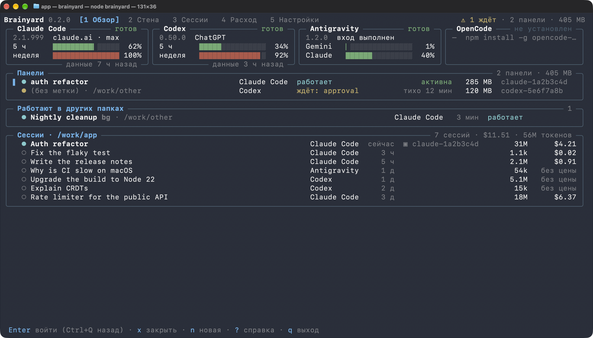
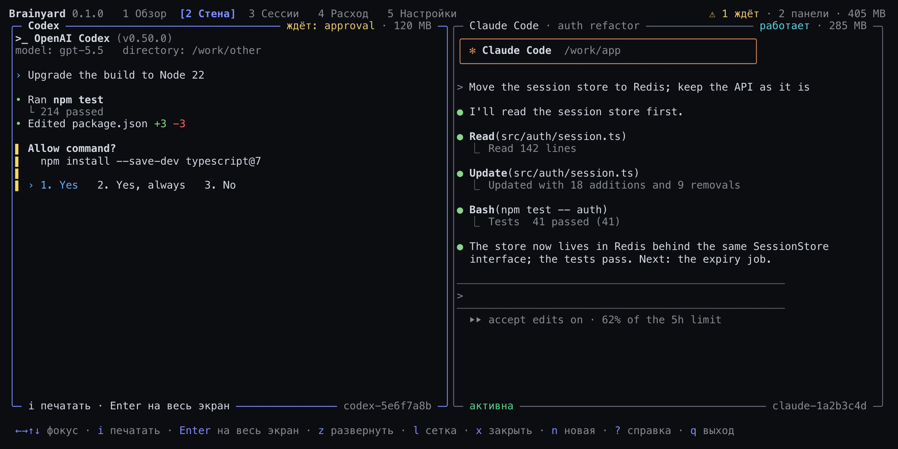
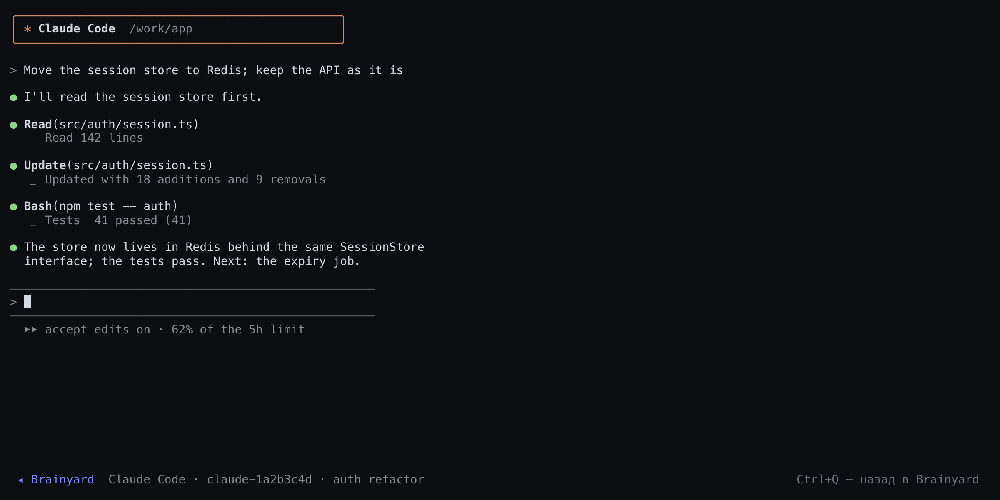
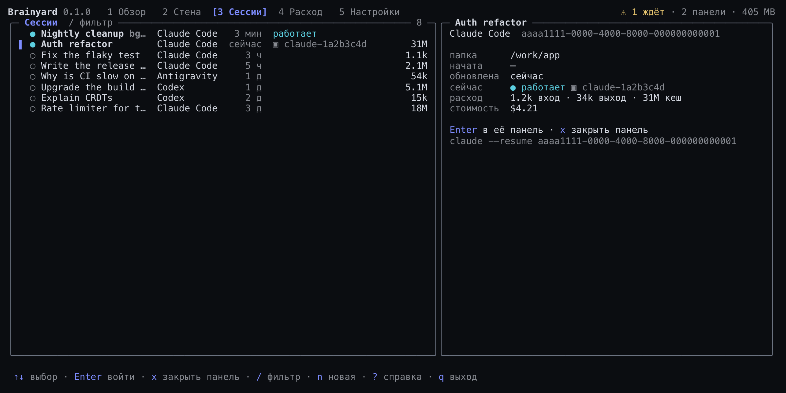
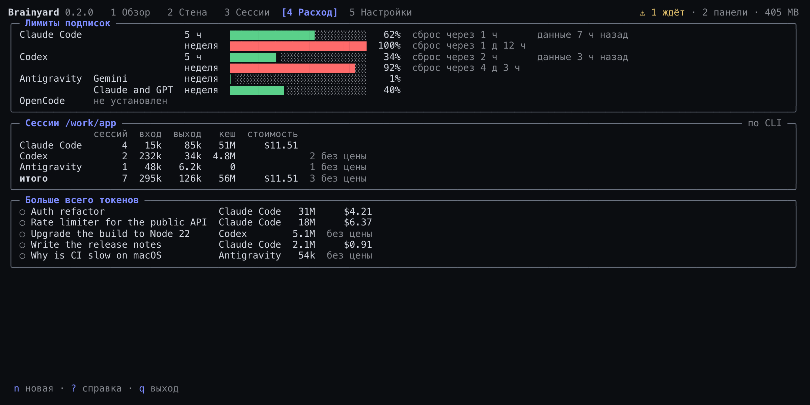
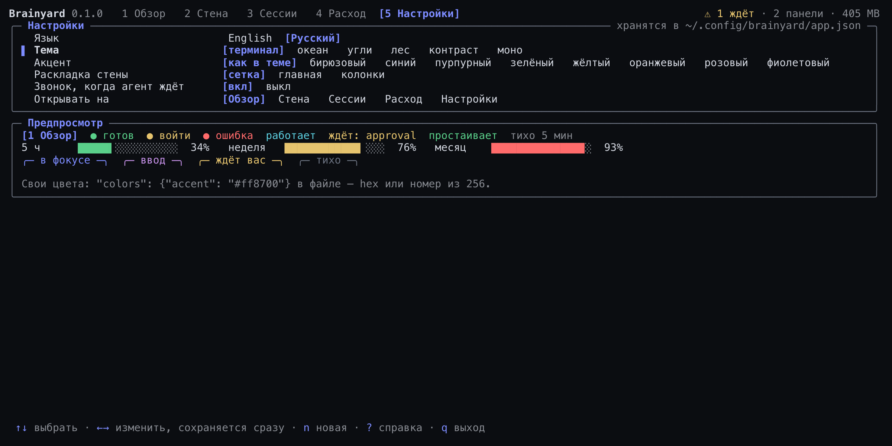
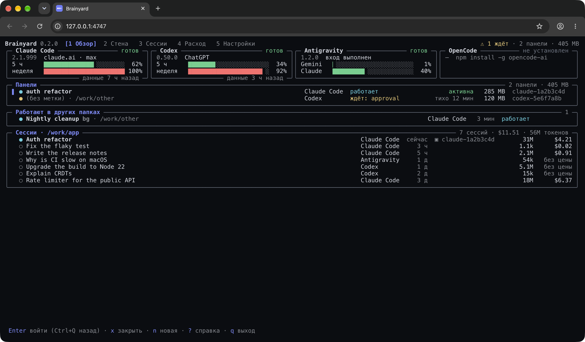

<div align="center">


# Brainyard

**Один интерфейс к агентам, которые у вас уже есть: Claude Code, Codex, Antigravity и OpenCode.**

Приложение, чтобы видеть их и управлять ими — в терминале или в браузере, — и API, чтобы
управлять ими из своей программы: статус и лимиты подписок, разовые ответы, запуски с живой
лентой, сессии, к которым вы возвращаетесь, и сессии CLI в панелях tmux, которые переживают
того, кто их запустил.

[](https://github.com/antondanv/brainyard/actions/workflows/ci.yml)
[](https://www.npmjs.com/package/@antondanv/brainyard)


[](LICENSE)

[English](README.md) · **Русский**



</div>

## Два пакета

| Пакет | Что внутри | Для кого |
|---|---|---|
| `@antondanv/brainyard-cli` | Полный: команда `brainyard` — приложение в терминале, `brainyard web` в браузере, команды для скриптов и локальный HTTP API | Для вас, за клавиатурой |
| `@antondanv/brainyard` | Лёгкий: только API, без зависимостей в рантайме — статус, вопросы, запуски, сессии, панели, расход | Для вашей программы |

```sh
npm install -g @antondanv/brainyard-cli    # приложение, браузер, команды
npm install @antondanv/brainyard           # API для своей программы
```

Команда построена на API, поэтому оба говорят и делают одно и то же. Нужен Node.js 22+ и хотя
бы один агентный CLI:

| CLI | Установка | Вход |
|---|---|---|
| Claude Code | `npm install -g @anthropic-ai/claude-code` | один раз запустить `claude` |
| Codex | `npm install -g @openai/codex` | `codex login` |
| Antigravity | `curl -fsSL https://antigravity.google/cli/install.sh \| bash` | один раз запустить `agy` |
| OpenCode | `npm install -g opencode-ai` | `opencode auth login` для провайдера (его бесплатным моделям вход не нужен) |

## Зачем

Claude Code, Codex, Antigravity и OpenCode — отличные агенты, но у каждого свой диалект: свои
флаги, свой формат потока событий, свой способ продолжить сессию, подключить MCP-сервер,
выбрать усилие или сообщить о лимите. И у каждого есть проблемы, которые видны только на
настоящем запуске: промпт, начинающийся с `---`, принимается за опцию командной строки; CLI не
завершается, потому что у него открыт stdin; ход кончается молча после отказа в инструменте.

Brainyard даёт им одно лицо. Вам — одно приложение, где видно каждого агента, сколько осталось
в его подписке, его сессии и живые панели. Вашей программе — один API: те же опции, те же
события и те же ошибки для всех четырёх, и все обходные пути уже внутри. Он запускает
установленные у вас CLI с вашими аккаунтами: никакого сервиса, никаких прямых вызовов API
моделей, никаких ключей на стороне.

Он вынесен из рабочей системы, которая каждый день гоняет эти CLI. Почти всё описанное ниже
существует потому, что без этого падал настоящий прогон ([проблемы CLI](docs/gotchas.md)).

## Приложение

`brainyard` в терминале — одно полноэкранное приложение; в пайпе или в скрипте вместо него
печатается таблица статуса. Карточка каждого агента показывает вход и лимиты подписки полосками
(у Claude Code — те, что последним получил его `/usage`); дальше панели — что делает CLI, сколько
памяти занимает и сколько молчит; сессии, которые работают в других папках; сессии этой папки с
токенами и стоимостью. Пока приложение открыто, всё перечитывается само; платных вызовов оно не
делает. Говорит по-английски или по-русски.

Enter — в выбранную панель на весь экран, Ctrl+Q — назад; на агенте Enter открывает новую
панель с ним, на сохранённой сессии — продолжает её в панели. `n` — новая панель в этой папке
(с выбором CLI), `x` — закрыть панель (сказанное в ней остаётся), `s` — остановить фоновую
сессию Claude Code, `r` — продолжить сохранённую сессию, Tab — к следующему разделу, `?` — все
клавиши, `q` — выход; панели продолжают работать. Русская раскладка тоже работает: клавиши
берутся по месту на клавиатуре.

Цифры 1–5 (или `[` `]`) открывают его страницы. **Стена** — живые экраны нескольких панелей
рядом, как окна в тайловом композиторе: сетка, главная плитка со стопкой или колонки (`l`).
Стрелки двигают фокус, `z` разворачивает плитку, `i` — печатать в неё (все клавиши, и Ctrl+C
тоже, уходят её CLI до Ctrl+Q), Enter — во весь экран, `n` — новая плитка, сразу с вводом.
Каждая панель подгоняется под размер своей плитки. Плитка желтеет, пока агент ждёт вас; в шапке
— сколько ждут, а терминал звенит, когда кто-то начинает ждать.



<table>
<tr>
<td width="50%"><br><b>Панель</b> на весь экран: все клавиши уходят её CLI; Ctrl+Q — назад.</td>
<td width="50%"><br><b>Сессии</b> — что работает в других папках и сессии этой папки; <code>/</code> — фильтр; карточка с токенами и командой, которой сессию продолжает её собственный CLI.</td>
</tr>
<tr>
<td width="50%"><br><b>Расход</b> — каждое окно подписки полоской, токены и стоимость папки по CLI и сессии, потратившие больше всех.</td>
<td width="50%"><br><b>Настройки</b> — язык, тема, акцент, раскладка стены, звонок и страница при запуске; хранятся в <code>~/.config/brainyard/app.json</code>, где <code>"colors"</code> принимает свои цвета.</td>
</tr>
</table>

В терминале мышь приложение оставляет ему, так что выделять и копировать текст можно где
угодно. На картинках — `npm run demo`, приложение на выдуманной машине.

### В браузере

`brainyard web` открывает то же приложение в браузере на этой машине. Сервер рисует кадры,
которые показал бы терминал, а страница выводит их клетка в клетку — страницы, стена, диалоги,
тема и язык те же.



Клавиши работают как в терминале. Щелчок открывает вкладку, выбирает строку, переводит фокус на
плитку или выбирает значение настройки; двойной щелчок — это Enter; колесо двигает выбор;
протянуть мышью — выделить текст, чтобы скопировать. Enter на панели показывает её CLI на весь
экран: все клавиши уходят ему, колесо листает назад то, что он напечатал, — до Ctrl+Q или
щелчка по полосе внизу. `q` закрывает приложение, а с ним и команду; панели работают дальше.

На том же сервере по адресу `/dashboard` — дашборд (`brainyard ui` поднимает его отдельно):
карточка статуса каждого CLI и песочница, где можно задать вопрос или запустить агента с живой
лентой, подсказками, остановкой и кнопкой «продолжить сессию».


Оба слушают `127.0.0.1` за той же защитой токеном, `Host` и `Origin`, что и
[HTTP API](#http-api), который остаётся под `/api/`.

## Командная строка

**Статус.** В пайпе или в скрипте `brainyard` печатает эту таблицу, как `brainyard status`:

```console
$ brainyard status
Brainyard 0.2.0

  ● Claude Code  2.1.280   ready         signed in with claude.ai, pro
  ● Codex        0.153.4   ready         signed in with ChatGPT · default model gpt-6-astra
  ● Antigravity  1.2.13    ready         signed in · model list fetched with your account
  ● OpenCode     1.18.34   ready         signed in with opencode, sber · default model sber/GigaChat-3-Pro

  4 of 4 ready · 3.6s · prove each with a real call: brainyard status --live
```

**Вопрос.** Ответ уходит в stdout, подробности в stderr, так что пайпы работают так, как
выглядят:

```console
$ git diff | brainyard ask claude --model haiku "Review this diff in three bullets"
$ brainyard ask codex --effort high "Explain CRDTs in two sentences" > crdt.md
$ brainyard ask all "In one short sentence: what is a monad?"
── Claude Code claude-opus-5-5 · 4.8s · $0.0079
A monad is a type that wraps values in a context, like optionality, lists, I/O, or state, …

── Codex gpt-6-astra · 9.1s
A monad is a programming abstraction that chains computations while managing context, …

── Antigravity 13.9s
A monad is a design pattern that wraps values in a computational context and enables …
```

**Агент.** Лента идёт в stderr. Пока агент работает, напишите реплику и нажмите Enter — она
дойдёт до него. Ctrl+C останавливает агента, а всё, что он уже записал, остаётся на диске.

```console
$ brainyard run claude --model haiku --cwd ./sandbox "Write fib.py, run it, tell me the output"
Claude Code is working · type a message + Enter to steer, Ctrl+C to stop
00:01 ◆ Claude Code started · claude-haiku-4-5-20251001
00:05 › I'll create a Fibonacci script and run it for you.
00:06 ✎ wrote fib.py
00:09 $ ran: python3 fib.py
00:11 › Done! The output is: 0 1 1 2 3 5 8 13 21 34
00:11 ✓ done in 11.6s · 2 actions · $0.0306

session 32a4caae-… · continue: brainyard run claude --resume 32a4caae-… "…"
```

`--json` печатает каждое событие строкой JSON, `--quiet` — только ответ. Как и `codex exec`,
`ask` и `run` читают stdin из пайпа и дописывают его к промпту; для этого они ждут конца ввода,
поэтому скрипту, который оставляет stdin открытым, нужен флаг `--no-stdin`.

**Сессии и панели.** `sessions --live` показывает, что работает на машине прямо сейчас, во всех
CLI, и чего оно ждёт. Панель — сессия CLI в tmux, которая переживает терминал: её запускают,
читают её экран, печатают в неё, разворачивают на весь экран и закрывают; разговор остаётся,
его можно продолжить. Панель называют по имени или по началу имени либо id её сессии. Текст,
выделенный мышью в развёрнутой панели, попадает в системный буфер обмена (`pbcopy`, `wl-copy`,
`xclip` или `xsel`; другую команду задаёт `BRAINYARD_COPY_COMMAND`).

```console
$ brainyard sessions --live
Claude Code  2dcf2506  24m      ~/Projects/Brainyard  CLI for the whole API ● working ▣ claude-a6d7c603
Claude Code  381a87e4  21h      ~/Projects/shop       Retry failed payments bg ● blocked

$ pane=$(brainyard pane start claude --name "release notes" "Draft the 0.2 release notes")
$ brainyard pane send $pane "Shorter, please"   # текст, потом Enter отдельной клавишей
$ brainyard pane show $pane                     # её экран текстом
$ brainyard pane attach $pane                   # на весь экран; Ctrl+Q — назад, она работает дальше
$ brainyard pane close $pane
closed claude-1a2b3c4d · resume: brainyard pane start claude --resume 7c919bf9-…
```

**Расход.** Сколько осталось в каждой подписке и сколько израсходовали сессии папки.
Модель не вызывается, пока нет `--live`; `--prices` переводит токены в доллары.

```console
$ brainyard usage
Subscription limits
  Claude Code  5h reset since seen   weekly 100% · resets in 1d 12h   seen 7h ago
  Codex        5h 52% · resets in 2h 36m   weekly 32% · resets in 5d 11h   seen 35m ago
  Antigravity  Gemini Models: weekly 1% · resets in 3d 21h   5h 0% · resets in 1h 27m
               Claude and GPT models: weekly 4% · resets in 3d 21h   5h 2% · resets in 2h 50m
  OpenCode     Connect OpenCode Go in OpenCode or provide OPENCODE_API_KEY to read subscription usage.

Sessions of ~/Projects/Brainyard
                                                     input  output  cache  reasoning      cost
  Claude Code  2dcf2506  now  CLI for the whole API    226    207k    31M       117k  no price
  Codex        01a10742  35m  Usage in the API        825k    122k    17M        58k  no price
  total                       2 sessions              825k    329k    48M       175k            + 2 without a price
```

| Команда | Что делает |
|---|---|
| `brainyard` | Приложение на весь экран: агенты и лимиты, панели, сессии, расход; в пайпе — статус |
| `brainyard status` | Какие CLI установлены, залогинены и готовы (`--live`, `--models`, `--json`) |
| `brainyard models [brain…]` | Модели и усилия каждого CLI |
| `brainyard ask <brain\|all> <prompt>` | Один вопрос, один ответ (`--model`, `--effort`, `--system`, `--web`) |
| `brainyard run <brain> <prompt>` | Агент с живой лентой (`--cwd`, `--resume`, `--access`, `--mcp`, `--no-web`, `--json`) |
| `brainyard sessions [brain…]` | Сессии этой папки, работающие отмечены; `--live` — что работает на машине сейчас (`--all`, `--cwd`, `--json`) |
| `brainyard stop <session>` | Останавливает фоновую сессию Claude Code; разговор остаётся |
| `brainyard open <brain> [prompt]` | CLI здесь, сессией, к которой возвращаются (`--resume`, `--name`, `--bg`) |
| `brainyard panes` | Живые панели: CLI, сессия, память, сколько молчит, папка (`--json`) |
| `brainyard pane start\|attach\|show\|send\|close` | Сессия CLI в панели tmux, которая переживает терминал |
| `brainyard usage [brain…]` | Лимиты подписок; токены и стоимость сессий этой папки (`--limits`, `--prices`, `--offline`, `--live`) |
| `brainyard web` | Приложение в браузере, на `http://127.0.0.1:4747` (`--port`, `--no-open`) |
| `brainyard ui` | Дашборд на `http://127.0.0.1:4747` |
| `brainyard serve` | Один HTTP API, для скриптов на любом языке (`--json`, `$BRAINYARD_TOKEN`) |

Мозги называются `claude`, `codex`, `antigravity` (или `agy`) и `opencode`. Все флаги — в `brainyard help`.

## Библиотека

На `@antondanv/brainyard` построено приложение, и всё, что оно делает, — функция, которую может
вызвать ваша программа. Каждая принимает `brain` — `claude`, `codex`, `antigravity` или
`opencode` — и одни и те же опции для всех четырёх.

### Статус и разовые ответы

```ts
import { ask, status } from '@antondanv/brainyard';

// Кто готов? Бесплатные проверки; `live: true` добавляет каждому вызов на одно слово.
const { ready } = await status(); // ['claude', 'codex', 'antigravity', 'opencode']

// Один вопрос, один ответ.
const { text, costUsd } = await ask('codex', 'One-line summary of RFC 9110?', { effort: 'low' });
```

`ask()` работает в новой временной папке, только на чтение и без `CLAUDE.md`, хуков и
MCP-серверов вашего проекта, а при любом сбое бросает `BrainyardError` с полем `kind`.

### Агент в папке

```ts
import { run, start } from '@antondanv/brainyard';

const agent = start({
  brain: 'claude',
  cwd: './app',
  prompt: 'Add a unit test for src/math.ts and make it pass',
  access: 'workspace', // правки и команды только внутри ./app
});

for await (const event of agent) {
  if (event.feed) console.log(event.summary); // "wrote test/math.test.ts", "ran: npm test", …
  if (event.kind === 'command' && event.summary.includes('npm test')) {
    agent.hint('Use vitest, not jest.'); // доходит до агента, пока он работает
  }
}

const result = await agent.result;
if (!result.ok) console.error(result.error); // { kind: 'usage_limit', resetsAt: '6:50pm', … }

// Позже — продолжить тот же разговор.
await run({ brain: 'claude', cwd: './app', resume: result.sessionId, prompt: 'Now add a benchmark' });
```

`hint()` доходит до работающих Claude Code, Antigravity и OpenCode; `stop()` останавливает
агента вместе со всем, что он запустил. `result` отклоняется, только если прогон так и не начался
(неверные опции, CLI не установлен); если CLI запустился, `result` разрешается — смотрите на
`result.ok`. MCP-серверы на один прогон задаются в одном формате и доставляются тем способом,
какой нужен конкретному CLI, общие конфиги не трогаются:

```ts
await run({
  brain: 'codex',
  prompt: 'Which markdown file in the docs is the longest? Summarise it.',
  mcpServers: {
    files: { command: 'npx', args: ['-y', '@modelcontextprotocol/server-filesystem', './docs'] },
  },
});
```

Больше примеров — в [`examples/`](examples).

### Сессии, к которым возвращаются

```ts
import { liveSessions, open, sessions } from '@antondanv/brainyard';

// Сессии этой папки во всех CLI, новые сверху; у работающей есть `live`.
for (const session of await sessions({ cwd: './app' })) {
  console.log(session.brain, session.id, session.title, session.live?.status);
}

// Что работает на машине прямо сейчас и кто ждёт вас.
const waiting = (await liveSessions()).filter((session) => session.live?.status === 'waiting');

// Сам CLI в этом терминале, пока человек из него не выйдет; потом — дорога обратно.
const { sessionId } = await open({ brain: 'claude', cwd: './app', name: 'review', prompt: 'Review the open PR' });
await open({ brain: 'claude', cwd: './app', resume: sessionId });
```

`sessions()` показывает то же, что выбор сессий в самом CLI: headless-запуски не попадают без
`headless: true`. `liveSessions()` читает текущий ход каждого CLI: `busy`, `waiting` (и чего
ждёт) или `idle`. Новые версии Codex не пишут окна подтверждения в журнал, поэтому
`liveSessions({ panes: {} })` читает ещё и окна на экране панелей Brainyard.
`open({ background: true })` запускает фоновую сессию Claude Code, а
`stopSession({ brain: 'claude', sessionId, cwd })` останавливает её через `claude stop`;
разговор остаётся, его можно открыть снова.

### Панели

```ts
import { capturePane, closePane, listPanes, sendToPane, startPane } from '@antondanv/brainyard';

// Сессия CLI в tmux: она работает дальше, когда эта программа завершится.
const { pane } = await startPane({ brain: 'claude', cwd: './app', label: 'flaky test', prompt: 'Fix the flaky test' });

const screen = await capturePane(pane); // её строки с цветами, курсор, размер
await sendToPane(pane, 'Run it ten times first');
await sendToPane(pane, '\r'); // Enter отдельной клавишей, как его жмёт человек

for (const each of await listPanes()) console.log(each.pane, each.brain, each.label, each.activityAt);

await closePane(pane); // CLI завершается; разговор можно продолжить
```

Панели живут на своём сервере tmux (`tmux -L brainyard`), поэтому переживают терминал,
приложение и вашу программу, а приложение, `brainyard pane …` и ваша программа видят одни и те
же панели. `attachPane(pane)` показывает панель на весь экран в этом терминале до Ctrl+Q;
`resizePane()` подгоняет её под ваш вид; `findPaneSession()` находит сессию, которую начала
панель Codex, Antigravity или OpenCode (у Claude Code она известна сразу); `panesAvailable()`
говорит, есть ли tmux.

### Расход и лимиты подписки

```ts
import { usage } from '@antondanv/brainyard';

const report = await usage({ cwd: './app', prices }); // ваши цены моделей в долларах за миллион токенов
for (const session of report.sessions) console.log(session.brain, session.id, session.usage, session.costUsd);
for (const brain of report.brains) console.log(brain.brain, brain.limits, brain.limitsObservedAt);

const limitsOnly = await usage({ limit: 0 }); // окна аккаунта, без сессий
```

`usage()` читает сохранённые сессии `cwd` (по умолчанию — текущей папки) во всех четырёх CLI и
окна каждой подписки:

| CLI | Токены и стоимость сохранённых сессий | Лимиты подписки |
|---|---|---|
| Claude Code | Весь транскрипт, каждое сообщение считается один раз по id; оценка по `prices` | То, что Claude Code сам получил последним (его `/usage`), из `~/.claude.json`; `rate_limit_event` при `live: true` |
| Codex | Последний накопительный итог rollout; стоимость по модели каждого хода | Самые свежие снимки из всего хранилища аккаунта |
| Antigravity | Метаданные генераций в `conversations/<id>.db`; оценка по `prices` | `agy -p /usage --output-format json`: недельные и пятичасовые квоты по группам моделей |
| OpenCode | Сообщения ассистента в `opencode.db` или сохранённые итоги сессии; стоимость от CLI или оценка по `prices` | API OpenCode Go: окна rolling, weekly и monthly |

- **Модель не вызывается**, пока нет `live: true`: это один минимальный изолированный вызов
  Claude с таймаутом 30 секунд, он может стоить денег. Antigravity и OpenCode Go отвечают на
  запросы метаданных без хода; `offline: true` пропускает и их и читает только хранилища.
- **Опции.** `brains` выбирает CLI, `sessionId` — одну сессию, `limit` — сколько сессий на CLI
  (200 по умолчанию, `0` — только лимиты), `limits: false` — только сессии (окна каждого CLI
  приходят как `not_requested`), `headless: true` добавляет headless-запуски, `homes` — другие
  хранилища.
- **Окна** несут долю `utilization` (`0.95` — 95%), `windowMinutes`, время сброса `resetsAt` в
  Unix-секундах, `limitId` для отдельных квот, а у Antigravity и у окон Claude Code по моделям —
  ещё `group` и `label`. Рядом — источник и время, когда окно видели: старый снимок не
  подтверждает текущее состояние, а окно, у которого прошло время сброса, о нём ничего не
  говорит.
- **Окна Claude Code** читаются бесплатно из его общего файла (`~/.claude.json` или файл в
  `CLAUDE_CONFIG_DIR`); кеш другого аккаунта, не того, что вошёл, не берётся
  (`limitsUnavailable: 'other_account'`).
- **OpenCode Go** берёт `OPENCODE_GO_API_KEY` или `OPENCODE_API_KEY`, затем ключи
  `opencode-go`/`opencode` из своего `auth.json` (или `OPENCODE_AUTH_CONTENT`); `apiKey` в
  конфиге OpenCode важнее сохранённого. Antigravity нужен вошедший CLI версии 1.1.11 или новее,
  `/usage` запускается в отдельной пустой папке.
- **Ничто не выдаётся за ноль.** Данные, которые не прочитать, — это `null` с причиной
  (`unavailableReason`, `limitsUnavailable`, `detail`); итог, который нельзя оценить, — `null`.
  `byModel` разбивает сессию по моделям. Оценка описывает использование моделей, а не платежи за
  подписку.

### Справочник

Опции `start()`, `run()` и `ask()`, что значит `access` в каждом CLI, события и что умеет
каждый CLI.

#### Опции

| Опция | По умолчанию | |
|---|---|---|
| `brain` | | `claude`, `codex`, `antigravity` или `opencode` |
| `prompt` | | Уходит в stdin, никогда не аргументом |
| `cwd` | `process.cwd()` | Где работает агент (у `ask()` — новая временная папка) |
| `model`, `effort` | как у CLI | Проверяются по каталогу CLI до запуска |
| `resume` | | `sessionId` из прошлого результата |
| `access` | `full` (у `ask()` — `readonly`) | См. ниже |
| `web`, `shell` | `true` (у `ask()` веб выключен) | Выключатели там, где они есть у CLI |
| `mcpServers` | | `{ имя: { command, args?, env? } }` |
| `steerable` | где поддерживается | Держать stdin открытым для `hint()` |
| `nudge` | `true` | Ход, кончившийся без текста, получает одно продолжение в том же разговоре |
| `timeoutMs` | нет | Прогон, убитый на середине, оплачен целиком, поэтому потолка по умолчанию нет |
| `env` | | Дополнительное окружение для CLI. Значение `undefined` (или `null`) убирает переменную, которую CLI унаследовал бы: `env: { NODE_ENV: undefined }` не пускает `NODE_ENV=production` программы-хозяина к агенту, где `npm install` пропустил бы devDependencies. То же у `open()` и `startPane()` (в панели это `unset` в оболочке панели) |
| `signal`, `onEvent`, `extraArgs`, `command`, `prices`, `includeRaw` | | |

#### Уровни доступа

Агенту без интерфейса некого спросить о разрешении, поэтому инструмент, которому нужно
подтверждение, просто получает отказ. Уровень выбирается заранее:

| `access` | Claude Code | Codex | Antigravity | OpenCode |
|---|---|---|---|---|
| `full` | все инструменты, без подтверждений | все инструменты, без песочницы | все инструменты, без подтверждений | все инструменты; `--auto` разрешает пути вне `cwd` |
| `workspace` | правки и команды в его песочнице, только внутри `cwd` | песочница `workspace-write` | правки; его песочница отклоняет большинство команд | правки внутри `cwd`; шелла нет — песочницы у него нет |
| `readonly` | только чтение и поиск | песочница `read-only` | режим плана: запись отклоняется | правки и шелл отклоняются |

Проверено настоящими прогонами на каждом CLI: в `workspace` файл внутри `cwd` пишется, а запись
в домашнюю папку падает; в `readonly` не пишется ничего. См.
[`scripts/live-check.ts`](scripts/live-check.ts).

#### События

Поток каждого CLI превращается в один закрытый список. У каждого события есть `summary` —
строка для человека с укороченными путями и замаскированными секретами. `feed: false` помечает
то, что правда, но не новость (размышление, успешный результат инструмента).

| kind | |
|---|---|
| `init` | CLI запустился: модель, id сессии |
| `message` / `thinking` | Агент что-то сказал / порассуждал |
| `tool_call` / `command` / `file_write` | Агент что-то сделал |
| `tool_result` | Что вернул инструмент (в ленте — только при сбое) |
| `hint` | Ваша реплика дошла до агента |
| `denied` | CLI отказал в инструменте |
| `warning` | Опция, которую этот CLI не умеет выполнить, упавший MCP-сервер, окно подписки на исходе |
| `error` / `stopped` | Что-то сломалось / прогон остановлен |
| `done` | Всегда последнее |

#### Что умеет каждый CLI

| | Claude Code | Codex | Antigravity | OpenCode |
|---|:-:|:-:|:-:|:-:|
| Реплики на ходу (`hint`) | ✓ | — | ✓ | ✓ через его сервер |
| Продолжение сессии | ✓ | ✓ | ✓ | ✓ |
| MCP-серверы на прогон | ✓ | ✓ | ✓ | ✓ |
| Сообщает стоимость в долларах | ✓ | только токены | только токены | ✓, если у провайдера есть цены |
| Список моделей | алиасы | ✓ | ✓ | ✓ |
| Веб можно выключить | ✓ | ✓ | — (предупреждение) | ✓ |
| Шелл можно выключить | ✓ | вместо этого песочница | — (предупреждение) | ✓ |
| Окна подписки (`usage`) | кеш его `/usage`; живой вызов | снимки rollout | команда `/usage` | API Go |

Опция, которую CLI выполнить не может, никогда не пропадает молча: она возвращается событием
`warning` и в `result.warnings`.

## HTTP API

`brainyard serve` поднимает один API, для скриптов на любом языке: статус, вопросы и запуски с
живой лентой, сессии, остановка фоновых, расход и панели. `brainyard web` и `brainyard ui`
отдают тот же API под `/api/`. Все адреса — в [`docs/http-api.md`](docs/http-api.md) (на
английском).

```sh
BRAINYARD_TOKEN=secret-for-scripts brainyard serve --json
{"url":"http://127.0.0.1:4747","port":4747,"token":"secret-for-scripts"}
```

Этот API умеет запускать агентов на вашей машине, поэтому и охраняется соответственно: слушает
только `127.0.0.1`, каждый вызов требует токен, заголовок `Host` обязан называть этот сервер
(защита от DNS rebinding), а запись принимается только JSON-ом с того же origin.

## Проблемы, пойманные при использовании

Несколько вещей, о которых Brainyard заботится за вас. Полный список с симптомами и
решениями — в [`docs/gotchas.md`](docs/gotchas.md) (на английском).

- **Промпт никогда не уходит в командную строку.** У Claude Code `-p` — булев флаг, поэтому
  промпт, начинающийся с `---`, превращается в `error: unknown option`. Каждому CLI промпт едет
  в stdin.
- **stdin закрывается ровно тогда, когда кончился ход.** Со stream-json на входе CLI считает
  stdin разговором и ждёт следующую реплику вечно — готовая работа висела бы, пока её не
  убьют.
- **Claude Code вливает реплику, пришедшую посреди хода, в текущий ход; Antigravity ставит её
  в очередь отдельным ходом со своим результатом.** Закрыть stdin не на том результате —
  значит потерять подсказку.
- **Код возврата 0 — не успех.** Antigravity раньше обрывал print mode через пять минут с
  кодом 0 посреди работы. Нет итогового результата — значит, ход оборван.
- **Молчаливый ход получает одно продолжение в том же разговоре.** Antigravity после отказа в
  инструменте заканчивает ход без единого слова. Новый процесс не помнил бы, обо что
  споткнулся прошлый.
- **Лимит подписки — это не 429.** Одно повторяют через секунды, другое сбрасывается через
  часы, и CLI говорит, когда именно. Brainyard это время сохраняет.
- **У OpenCode нет итогового события, а после отказа в инструменте он обрывает ход без слова.**
  Причина, с которой закончился последний шаг, отличает завершённый ход от оборванного, а
  Brainyard даёт агенту выслушать отказ и ответить.

## Как это проверено

- **440 тестов** гоняют настоящий код против поддельных `claude`, `codex`, `agy` и
  `opencode`, которые говорят на диалекте каждого. Как и настоящие CLI, подделки не выходят, пока
  открыт stdin: раннер, который забыл его закрыть, вешает тест, а не проходит его.
- **Приложение** — чистая функция от состояния к строкам экрана, так что его кадры проверяются
  как есть; кроме того, его проходят от начала до конца в настоящем tmux на своём сокете (не на
  сервере `brainyard`, в котором вы работаете) — в терминале и через `brainyard web` по HTTP.
- **`npm run live`** прогоняет все проверки на настоящих CLI самыми дешёвыми моделями: вопрос,
  промпт с дефисами, агентный прогон, подсказку, продолжение сессии, MCP и матрицу доступа.
  Последний прогон: Claude Code 2.1.280, Codex 0.153.4, Antigravity 1.2.13, все 21 проверка
  прошли примерно за $0.20. OpenCode 1.18.34 прошёл все 7 на GigaChat 3 Pro и на бесплатной
  `opencode/big-pickle` (модель задаёт `BRAINYARD_LIVE_OPENCODE_MODEL`).

## Вопросы

**Он зовёт API моделей или требует ключи?** Нет. Он запускает установленные вами CLI, которые
залогинены вашими подписками или ключами. Наружу не уходит ничего сверх того, что CLI отправил
бы и так.

**`full` — это опасно?** Это то же, что `--dangerously-skip-permissions` у Claude Code: агент
может выполнить любую команду. Для непроверенных промптов берите `workspace` или `readonly`,
или запускайте в контейнере.

**Почему нет таймаута по умолчанию?** Прогон, убитый на середине, оплачен целиком и не
возвращает ничего. Нужен потолок — задайте `timeoutMs`; `stop()` и `AbortSignal` работают
всегда.

**Windows?** Пока не проверялся. Батч-обёртки (`claude.cmd`) обрабатываются, но CI гоняет
Linux и macOS.

**А Gemini CLI или Cursor?** Пока нет. Новый CLI — это адаптер плюс живая проверка, и CLI
попадает в список, когда её проходит. OpenCode попал именно так.

## Участие

См. [CONTRIBUTING.md](CONTRIBUTING.md). Больше всего помогают баг-репорты с выводом
`brainyard status --json` и версией CLI.

## Лицензия

[MIT](LICENSE)
