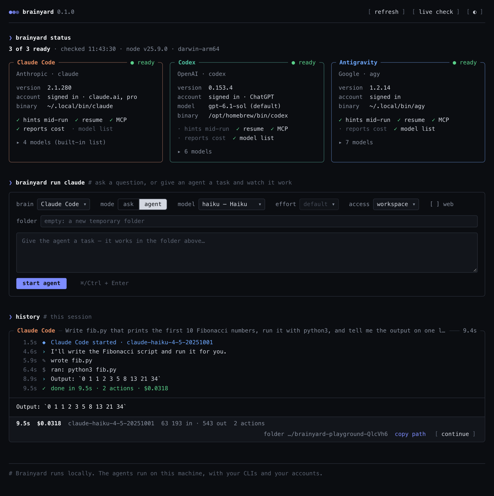
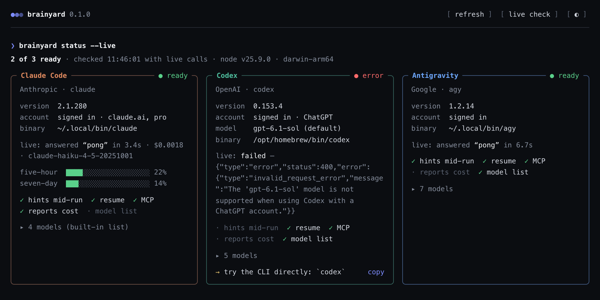

<div align="center">


# Brainyard

**Один интерфейс к агентам, которые у вас уже есть: Claude Code, Codex, Antigravity и OpenCode.**

Подключайте их к своим проектам через один универсальный API: задайте вопрос или запустите
агента в папке и смотрите живую ленту того, что он делает, человеческими словами. Из TypeScript,
по HTTP из любого языка, из терминала или из локальной веб-панели.

[](https://github.com/antondanv/brainyard/actions/workflows/ci.yml)
[](https://www.npmjs.com/package/@antondanv/brainyard)


[](LICENSE)

[English](README.md) · **Русский**



</div>

## Зачем

Claude Code, Codex, Antigravity и OpenCode — отличные агенты, но у каждого свои команды и методы: свои
флаги, свой формат потока событий, свой способ продолжить сессию, подключить MCP-сервер,
выбрать усилие рассуждения или сообщить о лимите. Подключить к проекту сразу несколько —
значит писать и поддерживать под каждый отдельную интеграцию. А ещё у каждого есть
проблемы, которые видны только на настоящем запуске: промпт, начинающийся с `---`, принимается
за опцию командной строки; CLI не завершается, потому что у него открыт stdin; ход кончается
молча после отказа в инструменте.

Brainyard — один универсальный инструмент под всех: те же опции, те же события и те же ошибки
для каждого, и все обходные пути уже внутри. Он запускает установленные у вас CLI с вашими
аккаунтами. Никакого сервиса, никаких прямых вызовов API моделей, никаких ключей на стороне.

Он вынесен из рабочей системы, которая каждый день гоняет все три CLI. Почти всё описанное ниже
существует потому, что без этого падал настоящий прогон ([проблемы CLI](docs/gotchas.md)).

## Возможности

- **Статус одной командой.** Установлен ли CLI, какая версия, залогинен ли и как, какие модели
  и уровни усилия есть. Всё бесплатно, где CLI это позволяет. `--live` проверяет каждый CLI
  вызовом на одно слово, а у Claude Code заодно показывает, сколько израсходовано из 5-часового
  и недельного окон подписки.
- **`ask()`.** Один вопрос, один ответ, в изоляции от вашего проекта: ни `CLAUDE.md`, ни хуки,
  ни MCP-серверы в промпт не просачиваются.
- **`start()` / `run()`.** Агент в папке, поток событий из закрытого списка
  (`message`, `command`, `file_write`, `tool_call`…) и человеческая строка на каждое.
- **Подсказки на ходу.** `hint()` отправляет реплику работающему агенту (Claude Code,
  Antigravity, OpenCode). `stop()` останавливает его вместе со всем, что он запустил.
- **Сессии.** Каждый прогон возвращает `sessionId`; передайте его в `resume`, чтобы продолжить.
- **Модели и усилие.** Список спрашивается у самого CLI, выбор проверяется до запуска: Claude
  Code незнакомое усилие молча заменяет своим умолчанием, и вы заплатили бы не за то, что
  выбрали.
- **Уровни доступа.** `full`, `workspace` и `readonly` на флагах прав и песочниц каждого CLI.
  Проверено живыми прогонами, включая «за пределы папки ничего не пишется».
- **MCP-серверы на один прогон.** Один формат конфига, доставка тем способом, какой нужен
  конкретному CLI, общие конфиги не трогаются.
- **Типизированные сбои.** `usage_limit` (со временем сброса), `rate_limited`,
  `not_logged_in`, `network`… Сразу видно, ждать минуту, ждать до 18:50 или идти логиниться.
- **Одно приложение.** `brainyard` открывает в терминале полноэкранное приложение: агенты и
  лимиты, панели, сессии и использование. Enter — в панель, Ctrl+Q — назад.
- **Веб-панель.** `brainyard ui` открывает карточки статуса и песочницу поверх локального
  HTTP API под токеном, которым можно пользоваться и из других языков.
- **Ноль зависимостей в рантайме.**

## Установка

```sh
npm install -g @antondanv/brainyard-cli    # команда brainyard и дашборд
npm install @antondanv/brainyard           # только библиотека
```

Нужен Node.js 22+ и хотя бы один агентный CLI:

| CLI | Установка | Вход |
|---|---|---|
| Claude Code | `npm install -g @anthropic-ai/claude-code` | один раз запустить `claude` |
| Codex | `npm install -g @openai/codex` | `codex login` |
| Antigravity | `curl -fsSL https://antigravity.google/cli/install.sh \| bash` | один раз запустить `agy` |
| OpenCode | `npm install -g opencode-ai` | `opencode auth login` для провайдера (его бесплатным моделям вход не нужен) |

## Командная строка

**Приложение.** `brainyard` в терминале — одно полноэкранное приложение: агенты с лимитами
подписок; панели — что делает CLI, сколько памяти занимает и сколько молчит; сессии, которые
работают в других папках; сессии этой папки с токенами и стоимостью. Пока оно открыто, всё
перечитывается само; платных вызовов приложение не делает.

```console
$ brainyard
Brainyard 0.2.0 · ~/code/app                                                        2 panes · 405 MB

Agents
  ● Claude Code  2.1.280   ready         signed in with claude.ai, max
    limits  not checked: brainyard usage --live (one tiny real call)
  ● Codex        0.153.4   ready         signed in with ChatGPT · default model gpt-6-astra
    limits  5h 34% · resets in 2h   weekly 92% · resets in 4d 3h   seen 3h ago
  ● Antigravity  1.2.13    ready         signed in · model list fetched with your account
    limits  Gemini Models: weekly 1%
            Claude and GPT models: weekly 40%
  ● OpenCode     —         not installed → npm install -g opencode-ai

Panes · 2
› claude-1a2b3c4d  Claude Code  aaaa1111  285 MB  working            active     ~/code/app    auth refactor
  codex-5e6f7a8b   Codex        bbbb2222  120 MB  waiting: approval  quiet 12m  ~/code/other

Running in other folders · 1
  Claude Code  cccc3333  3m       ~/code/other  Nightly cleanup bg ● working

Sessions of ~/code/app · 3 · $4.23 + 1 unpriced · 14k in · 38k out · 31M cache
  Claude Code  aaaa1111  now  1.2k in   34k out  31M cache     $4.21  Auth refactor ● working ▣ claude-1a2b3c4d
  Claude Code  dddd4444  3h    950 in   120 out                $0.02  Fix the flaky test
  Codex        eeee5555  2d    12k in  3.4k out             no price  Explain CRDTs

 Enter go in (Ctrl+Q back) · x close · n new · ? help · q quit
```

Enter — в выбранную панель на весь экран, Ctrl+Q — назад; на агенте Enter открывает новую
панель с ним, на сохранённой сессии — продолжает её в панели. `n` — новая панель в этой папке
(с выбором CLI), `x` — закрыть панель (сказанное в ней остаётся), `s` — остановить фоновую
сессию Claude Code, `r` — продолжить сохранённую сессию, Tab — к следующему разделу, `?` —
все клавиши, `q` — выход; панели продолжают работать. Русская раскладка тоже работает: клавиши
берутся по месту на клавиатуре.

Цифры 1–5 (или `[` `]`) открывают его страницы:

- **Стена** — живые экраны нескольких панелей рядом, как окна в тайловом композиторе: сетка,
  главная плитка со стопкой или колонки (`l`). Стрелки двигают фокус, `z` разворачивает плитку,
  `i` — печатать в неё (все клавиши, и Ctrl+C тоже, уходят её CLI до Ctrl+Q), Enter — во весь
  экран, `n` — новая плитка, сразу с вводом. Каждая панель подгоняется под размер своей плитки.
  Плитка желтеет, пока агент ждёт вас; в шапке — сколько ждут, а терминал звенит, когда кто-то
  начинает ждать.
- **Сессии** — что работает в других папках и сессии этой папки; `/` — фильтр; карточка с
  токенами по моделям и командой, которой сессию продолжает её собственный CLI.
- **Использование** — каждое окно подписки полоской, токены и стоимость папки по CLI и сессии,
  потратившие больше всех.
- **Настройки** — тема (terminal, ocean, ember, forest, contrast, mono), акцент, раскладка стены,
  звонок и страница при запуске; хранятся в `~/.config/brainyard/app.json`, где `"colors"`
  принимает свои цвета (`"accent": "#ff8700"` или номер из 256).

```console
Brainyard 0.2.0   1 Overview  [2 Wall]  3 Sessions   4 Usage   5 Settings      ⚠ 1 waiting · 2 panes
╭─ Codex ─────────── waiting: approval · 120 MB ─╮╭─ Claude Code · auth refac… ─ working · 285 MB ─╮
│Allow command? [y/n]                            ││Editing src/auth.ts…                            │
│                                                ││                                                │
╰─ i type · Enter full screen ─── codex-5e6f7a8b ─╯╰─ active ───────────────────── claude-1a2b3c4d ─╯
 ←→↑↓ focus · i type · Enter full screen · z zoom · l grid · x close · n new · ? help · q quit
```

Мышь приложение оставляет терминалу, так что выделять и копировать текст можно где угодно.

**Статус.** В пайпе или в скрипте `brainyard` печатает эту таблицу, как `brainyard status`:

```console
$ brainyard status
Brainyard 0.1.0

  ● Claude Code  2.1.280   ready         signed in with claude.ai, pro
  ● Codex        0.153.4   ready         signed in with ChatGPT · default model gpt-6-astra
  ● Antigravity  1.2.13    ready         signed in · model list fetched with your account
  ● OpenCode     1.18.34   ready         signed in with opencode, sber · default model sber/GigaChat-3-Pro

  4 of 4 ready · 3.6s · prove each with a real call: brainyard status --live
```

**Вопрос.** Ответ уходит в stdout, подробности в stderr, так что пайпы работают так, как
выглядят:

```console
$ git diff | brainyard ask claude --model haiku "Review this diff in three bullets"
$ brainyard ask codex --effort high "Explain CRDTs in two sentences" > crdt.md
$ brainyard ask all "In one short sentence: what is a monad?"
── Claude Code claude-opus-5-5 · 4.8s · $0.0079
A monad is a type that wraps values in a context, like optionality, lists, I/O, or state, …

── Codex gpt-6-astra · 9.1s
A monad is a programming abstraction that chains computations while managing context, …

── Antigravity 13.9s
A monad is a design pattern that wraps values in a computational context and enables …
```

**Агент.** Лента идёт в stderr. Пока агент работает, напишите реплику и нажмите Enter — она
дойдёт до него. Ctrl+C останавливает агента, а всё, что он уже записал, остаётся на диске.

```console
$ brainyard run claude --model haiku --cwd ./sandbox "Write fib.py, run it, tell me the output"
Claude Code is working · type a message + Enter to steer, Ctrl+C to stop
00:01 ◆ Claude Code started · claude-haiku-4-5-20251001
00:05 › I'll create a Fibonacci script and run it for you.
00:06 ✎ wrote fib.py
00:09 $ ran: python3 fib.py
00:11 › Done! The output is: 0 1 1 2 3 5 8 13 21 34
00:11 ✓ done in 11.6s · 2 actions · $0.0306

session 32a4caae-… · continue: brainyard run claude --resume 32a4caae-… "…"
```

`--json` печатает каждое событие строкой JSON, `--quiet` — только ответ. Как и `codex exec`,
`ask` и `run` читают stdin из пайпа и дописывают его к промпту; для этого они ждут конца ввода,
поэтому скрипту, который оставляет stdin открытым, нужен флаг `--no-stdin`.

**Сессии и панели.** `sessions --live` показывает, что работает на машине прямо сейчас, во всех
CLI, и чего оно ждёт. Панель — сессия CLI в tmux, которая переживает терминал: её запускают,
читают её экран, печатают в неё, разворачивают на весь экран и закрывают; разговор остаётся,
его можно продолжить. Панель называют по имени или по началу имени либо id её сессии. Текст,
выделенный мышью в развёрнутой панели, попадает в системный буфер обмена (`pbcopy`, `wl-copy`,
`xclip` или `xsel`; другую команду задаёт `BRAINYARD_COPY_COMMAND`).

```console
$ brainyard sessions --live
Claude Code  2dcf2506  24m      ~/Projects/Brainyard  CLI for the whole API ● working ▣ claude-a6d7c603
Claude Code  381a87e4  21h      ~/Projects/Treeyard   GitHub issues in the tree bg ● blocked

$ pane=$(brainyard pane start claude --name "release notes" "Draft the 0.2 release notes")
$ brainyard pane send $pane "Shorter, please"   # текст, потом Enter отдельной клавишей
$ brainyard pane show $pane                     # её экран текстом
$ brainyard pane attach $pane                   # на весь экран; Ctrl+Q — назад, она работает дальше
$ brainyard pane close $pane
closed claude-1a2b3c4d · resume: brainyard pane start claude --resume 7c919bf9-…
```

**Использование.** Сколько осталось в каждой подписке и сколько израсходовали сессии папки.
Модель не вызывается, пока нет `--live`; `--prices` переводит токены в доллары.

```console
$ brainyard usage
Subscription limits
  Claude Code  not checked: --live asks with one tiny real call, which may cost
  Codex        5h 52% · resets in 2h 36m   weekly 32% · resets in 5d 11h   seen 35m ago
  Antigravity  Gemini Models: weekly 1% · resets in 3d 21h   5h 0% · resets in 1h 27m
               Claude and GPT models: weekly 4% · resets in 3d 21h   5h 2% · resets in 2h 50m
  OpenCode     Connect OpenCode Go in OpenCode or provide OPENCODE_API_KEY to read subscription usage.

Sessions of ~/Projects/Brainyard
                                                     input  output  cache  reasoning      cost
  Claude Code  2dcf2506  now  CLI for the whole API    226    207k    31M       117k  no price
  Codex        01a10742  35m  Usage in the API        825k    122k    17M        58k  no price
  total                       2 sessions              825k    329k    48M       175k            + 2 without a price
```

| Команда | Что делает |
|---|---|
| `brainyard` | Приложение на весь экран: агенты и лимиты, панели, сессии, использование; в пайпе — статус |
| `brainyard status` | Какие CLI установлены, залогинены и готовы (`--live`, `--models`, `--json`) |
| `brainyard models [brain…]` | Модели и усилия каждого CLI |
| `brainyard ask <brain\|all> <prompt>` | Один вопрос, один ответ (`--model`, `--effort`, `--system`, `--web`) |
| `brainyard run <brain> <prompt>` | Агент с живой лентой (`--cwd`, `--resume`, `--access`, `--mcp`, `--no-web`, `--json`) |
| `brainyard sessions [brain…]` | Сессии этой папки, работающие отмечены; `--live` — что работает на машине сейчас (`--all`, `--cwd`, `--json`) |
| `brainyard stop <session>` | Останавливает фоновую сессию Claude Code; разговор остаётся |
| `brainyard open <brain> [prompt]` | CLI здесь, сессией, к которой возвращаются (`--resume`, `--name`, `--bg`) |
| `brainyard panes` | Живые панели: CLI, сессия, память, сколько молчит, папка (`--json`) |
| `brainyard pane start\|attach\|show\|send\|close` | Сессия CLI в панели tmux, которая переживает терминал |
| `brainyard usage [brain…]` | Лимиты подписок; токены и стоимость сессий этой папки (`--limits`, `--prices`, `--offline`, `--live`) |
| `brainyard ui` | Панель на `http://127.0.0.1:4747` |
| `brainyard serve` | Один HTTP API, для скриптов на любом языке (`--json`, `$BRAINYARD_TOKEN`) |

Мозги называются `claude`, `codex`, `antigravity` (или `agy`) и `opencode`. Все флаги — в `brainyard help`.

## Библиотека

```ts
import { ask, run, start, status } from '@antondanv/brainyard';

// Кто готов? Бесплатные проверки; `live: true` добавляет каждому вызов на одно слово.
const { ready } = await status(); // ['claude', 'codex', 'antigravity', 'opencode']

// Один вопрос, один ответ.
const { text, costUsd } = await ask('codex', 'One-line summary of RFC 9110?', { effort: 'low' });

// Агент в папке, событие за событием.
const agent = start({
  brain: 'claude',
  cwd: './app',
  prompt: 'Add a unit test for src/math.ts and make it pass',
  access: 'workspace', // правки и команды только внутри ./app
});

for await (const event of agent) {
  if (event.feed) console.log(event.summary); // "wrote test/math.test.ts", "ran: npm test", …
  if (event.kind === 'command' && event.summary.includes('npm test')) {
    agent.hint('Use vitest, not jest.'); // доходит до агента, пока он работает
  }
}

const result = await agent.result;
if (!result.ok) console.error(result.error); // { kind: 'usage_limit', resetsAt: '6:50pm', … }

// Позже — продолжить тот же разговор.
await run({ brain: 'claude', cwd: './app', resume: result.sessionId, prompt: 'Now add a benchmark' });
```

MCP-серверы на один прогон:

```ts
await run({
  brain: 'codex',
  prompt: 'Which markdown file in the docs is the longest? Summarise it.',
  mcpServers: {
    files: { command: 'npx', args: ['-y', '@modelcontextprotocol/server-filesystem', './docs'] },
  },
});
```

`result` отклоняется, только если прогон так и не начался (неверные опции, CLI не установлен).
Если CLI запустился, `result` разрешается — смотрите на `result.ok`. `ask()` при любом сбое
бросает `BrainyardError` с полем `kind`. Больше примеров — в [`examples/`](examples).

### Сохранённые фоновые сессии

`stopSession({ brain: 'claude', sessionId, cwd })` останавливает сохранённую фоновую
сессию Claude Code через `claude stop`. Перед остановкой обновляет её короткий id
и проверяет папку. Разговор остаётся в истории Claude Code; продолжить его можно
через `open({ brain: 'claude', resume: sessionId, cwd })`.
Возвращает `stopped` или `not-running`; при сбое CLI выбрасывает `BrainyardError`.
Сессии в панелях tmux закрываются через `closePane()`.

### Живые статусы сессий

`liveSessions()` читает текущий ход каждого CLI. Журнал Codex разбирается один раз,
затем читаются только новые записи: длинный ход сохраняет своё состояние.
Ожидание вопроса или разрешения снимается по соответствующему ответу.
Завершённые и прерванные ходы Codex уходят из списка живых сессий.

Новые версии Codex не записывают запросы разрешения на команды в журнал.
`liveSessions({ panes: {} })` дополнительно проверяет текущие окна Codex на сервере
tmux Brainyard; `panes: { socket }` выбирает отдельный сервер. Читается только
текущий экран панели. Вне этих панелей видимость запросов разрешения зависит от
того, что CLI записывает в журнал.

### Лимиты подписки и использование сохранённых сессий

```ts
import { usage } from '@antondanv/brainyard';

const report = await usage({ cwd: './app', prices }); // ваши цены моделей за миллион токенов
for (const session of report.sessions) {
  console.log(session.brain, session.id, session.usage, session.costUsd, session.costSource);
}
for (const brain of report.brains) {
  console.log(brain.brain, brain.limits, brain.limitsObservedAt, brain.detail);
}

const one = await usage({ cwd: './app', brains: ['codex'], sessionId, prices });
const subscriptions = await usage({ brains: ['antigravity', 'opencode'], limit: 0 });
const saved = await usage({ cwd: './app', offline: true, prices }); // только хранилища
const limits = await usage({ brains: ['claude'], live: true, limit: 0 });
```

`usage()` читает сохранённые сессии `cwd` (по умолчанию — текущей папки) для Claude
Code, Codex, Antigravity и OpenCode. Как `sessions()`, исключает headless-запуски без
`headless: true`, возвращает не больше 200 сессий на CLI и принимает пути хранилищ
через `homes`. `sessionId` выбирает конкретную сессию этой папки; `limit: 0` читает
только лимиты аккаунта. Хранилище OpenCode — `$XDG_DATA_HOME/opencode` или
`~/.local/share/opencode`.

| CLI | Токены и стоимость сохранённых сессий | Лимиты подписки |
|---|---|---|
| Claude Code | Весь транскрипт, каждое сообщение считается один раз по id; оценка по `prices` | `rate_limit_event` при `live: true` |
| Codex | Последний накопительный итог rollout; стоимость по модели каждого хода | Самые свежие снимки из всего хранилища аккаунта |
| Antigravity | Метаданные генераций в `conversations/<id>.db`; оценка по `prices` | `agy -p /usage --output-format json`: недельные и пятичасовые квоты по группам моделей |
| OpenCode | Сообщения ассистента в `opencode.db` или сохранённые итоги сессии; положительная стоимость от CLI или оценка по `prices` | API OpenCode Go: окна подписки rolling, weekly и monthly |

У окон есть доля `utilization` (`0.95` — 95%), необязательная длительность
`windowMinutes`, время сброса `resetsAt` в Unix-секундах и `limitId` для отдельных
квот. У Antigravity также есть `group` и `label`. Рядом — источник (`rollout`, `live`,
`cli` или `api`) и время наблюдения: старый снимок
не подтверждает текущее состояние. Лимиты относятся к аккаунту и не зависят от
выбранной папки или сессии.

По умолчанию Antigravity и OpenCode Go получают данные подписки без обращения к
модели. Antigravity нужен авторизованный CLI версии 1.1.11 или новее; `/usage`
запускается в отдельной пустой временной папке. `homes.antigravity` выбирает сохранённые
разговоры; лимиты относятся к текущему входу CLI. OpenCode Go использует
`OPENCODE_GO_API_KEY` или `OPENCODE_API_KEY`, затем API-ключи `opencode-go`/`opencode`
из `auth.json` (либо `OPENCODE_AUTH_CONTENT`). `options.apiKey` провайдера в глобальном,
явно заданном, проектном или встроенном конфиге OpenCode может переопределить ключ
из хранилища; поддерживается `{env:NAME}`. Если ключа или подписки Go нет, возвращается
причина. `offline: true` отключает оба запроса и читает только хранилища; его нельзя
совместить с `live: true`.

`live: true` делает один минимальный изолированный вызов Claude, по умолчанию с
таймаутом 30 секунд; вызов может стоить денег. Сохранённые разговоры не продолжает.
Даже при отказе возвращает полученные окна вместе с `error`. Вызов настраивается
через `commands`, `env`, `timeoutMs` и `signal`; последние три опции действуют и на
запрос Go. Таймаут по умолчанию — 30 секунд для Claude и Antigravity, 10 секунд для
Go. Без `live` обращений к модели нет.

Если данных нет, `usage` или `limits` равны `null`, а причину объясняют
`unavailableReason` или `limitsUnavailable`/`detail`. Старые разговоры Antigravity
без читаемых метаданных генераций остаются неизвестными. `byModel` разбивает токены
и стоимость сессии по моделям. `prices` задаются как в `run()`; ключи OpenCode —
`provider/model`. Если часть использования не удалось оценить, полная стоимость
равна `null`. Провайдеры OpenCode без цен в каталоге могут записывать нулевую
стоимость: при ненулевых токенах для неё тоже нужны `prices`. Оценка описывает
использование моделей, а не платежи за подписку.

### Опции

| Опция | По умолчанию | |
|---|---|---|
| `brain` | | `claude`, `codex`, `antigravity` или `opencode` |
| `prompt` | | Уходит в stdin, никогда не аргументом |
| `cwd` | `process.cwd()` | Где работает агент (у `ask()` — новая временная папка) |
| `model`, `effort` | как у CLI | Проверяются по каталогу CLI до запуска |
| `resume` | | `sessionId` из прошлого результата |
| `access` | `full` (у `ask()` — `readonly`) | См. ниже |
| `web`, `shell` | `true` (у `ask()` веб выключен) | Выключатели там, где они есть у CLI |
| `mcpServers` | | `{ имя: { command, args?, env? } }` |
| `steerable` | где поддерживается | Держать stdin открытым для `hint()` |
| `nudge` | `true` | Ход, кончившийся без текста, получает одно продолжение в том же разговоре |
| `timeoutMs` | нет | Прогон, убитый на середине, оплачен целиком, поэтому потолка по умолчанию нет |
| `signal`, `onEvent`, `env`, `extraArgs`, `command`, `prices`, `includeRaw` | | |

### Уровни доступа

Агенту без интерфейса некого спросить о разрешении, поэтому инструмент, которому нужно
подтверждение, просто получает отказ. Уровень выбирается заранее:

| `access` | Claude Code | Codex | Antigravity | OpenCode |
|---|---|---|---|---|
| `full` | все инструменты, без подтверждений | все инструменты, без песочницы | все инструменты, без подтверждений | все инструменты; `--auto` разрешает пути вне `cwd` |
| `workspace` | правки и команды в его песочнице, только внутри `cwd` | песочница `workspace-write` | правки; его песочница отклоняет большинство команд | правки внутри `cwd`; шелла нет — песочницы у него нет |
| `readonly` | только чтение и поиск | песочница `read-only` | режим плана: запись отклоняется | правки и шелл отклоняются |

Проверено настоящими прогонами на каждом CLI: в `workspace` файл внутри `cwd` пишется, а запись
в домашнюю папку падает; в `readonly` не пишется ничего. См.
[`scripts/live-check.ts`](scripts/live-check.ts).

### События

Поток каждого CLI превращается в один закрытый список. У каждого события есть `summary` —
строка для человека с укороченными путями и замаскированными секретами. `feed: false` помечает
то, что правда, но не новость (размышление, успешный результат инструмента).

| kind | |
|---|---|
| `init` | CLI запустился: модель, id сессии |
| `message` / `thinking` | Агент что-то сказал / порассуждал |
| `tool_call` / `command` / `file_write` | Агент что-то сделал |
| `tool_result` | Что вернул инструмент (в ленте — только при сбое) |
| `hint` | Ваша реплика дошла до агента |
| `denied` | CLI отказал в инструменте |
| `warning` | Опция, которую этот CLI не умеет выполнить, упавший MCP-сервер, окно подписки на исходе |
| `error` / `stopped` | Что-то сломалось / прогон остановлен |
| `done` | Всегда последнее |

### Что умеет каждый CLI

| | Claude Code | Codex | Antigravity | OpenCode |
|---|:-:|:-:|:-:|:-:|
| Реплики на ходу (`hint`) | ✓ | — | ✓ | ✓ через его сервер |
| Продолжение сессии | ✓ | ✓ | ✓ | ✓ |
| MCP-серверы на прогон | ✓ | ✓ | ✓ | ✓ |
| Сообщает стоимость в долларах | ✓ | только токены | только токены | ✓, если у провайдера есть цены |
| Список моделей | алиасы | ✓ | ✓ | ✓ |
| Веб можно выключить | ✓ | ✓ | — (предупреждение) | ✓ |
| Шелл можно выключить | ✓ | вместо этого песочница | — (предупреждение) | ✓ |
| Окна подписки (`usage`) | живой вызов | снимки rollout | команда `/usage` | API Go |

Опция, которую CLI выполнить не может, никогда не пропадает молча: она возвращается событием
`warning` и в `result.warnings`.

## Панель и HTTP API

`brainyard ui` поднимает панель со скриншота наверху: карточки статуса и песочницу, где можно
задать вопрос или запустить агента с живой лентой, подсказками, остановкой и кнопкой
«продолжить сессию». **Live check** отправляет каждому CLI промпт на одно слово и показывает,
сколько израсходовано из окон подписки Claude Code, а если CLI не ответил — почему:



Под панелью небольшой HTTP API, который можно звать из любого языка; `brainyard serve` поднимает
его один, без браузера. Кроме вопросов и запусков он показывает сессии, останавливает фоновые,
отдаёт использование и управляет панелями: [`docs/http-api.md`](docs/http-api.md).

Этот API умеет запускать агентов на вашей машине, поэтому и охраняется соответственно: слушает
только `127.0.0.1`, каждый вызов требует токен, напечатанный при старте, заголовок `Host`
обязан называть этот сервер (защита от DNS rebinding), а запись принимается только JSON-ом с
того же origin.

## Проблемы, пойманные при использовании

Несколько вещей, о которых Brainyard заботится за вас. Полный список с симптомами и
решениями — в [`docs/gotchas.md`](docs/gotchas.md) (на английском).

- **Промпт никогда не уходит в командную строку.** У Claude Code `-p` — булев флаг, поэтому
  промпт, начинающийся с `---`, превращается в `error: unknown option`. Каждому CLI промпт едет
  в stdin.
- **stdin закрывается ровно тогда, когда кончился ход.** Со stream-json на входе CLI считает
  stdin разговором и ждёт следующую реплику вечно — готовая работа висела бы, пока её не
  убьют.
- **Claude Code вливает реплику, пришедшую посреди хода, в текущий ход; Antigravity ставит её
  в очередь отдельным ходом со своим результатом.** Закрыть stdin не на том результате —
  значит потерять подсказку.
- **Код возврата 0 — не успех.** Antigravity раньше обрывал print mode через пять минут с
  кодом 0 посреди работы. Нет итогового результата — значит, ход оборван.
- **Молчаливый ход получает одно продолжение в том же разговоре.** Antigravity после отказа в
  инструменте заканчивает ход без единого слова. Новый процесс не помнил бы, обо что
  споткнулся прошлый.
- **Лимит подписки — это не 429.** Одно повторяют через секунды, другое сбрасывается через
  часы, и CLI говорит, когда именно. Brainyard это время сохраняет.
- **У OpenCode нет итогового события, а после отказа в инструменте он обрывает ход без слова.**
  Причина, с которой закончился последний шаг, отличает завершённый ход от оборванного, а
  Brainyard даёт агенту выслушать отказ и ответить.

## Как это проверено

- **237 тестов** гоняют настоящий код против поддельных `claude`, `codex`, `agy` и `opencode`,
  которые говорят на диалекте каждого. Как и настоящие CLI, подделки не выходят, пока открыт stdin: раннер,
  который забыл его закрыть, вешает тест, а не проходит его.
- **`npm run live`** прогоняет все проверки на настоящих CLI самыми дешёвыми моделями: вопрос,
  промпт с дефисами, агентный прогон, подсказку, продолжение сессии, MCP и матрицу доступа.
  Последний прогон: Claude Code 2.1.280, Codex 0.153.4, Antigravity 1.2.13, все 21 проверка
  прошли примерно за $0.20. OpenCode 1.18.34 прошёл все 7 на GigaChat 3 Pro и на бесплатной
  `opencode/big-pickle` (модель задаёт `BRAINYARD_LIVE_OPENCODE_MODEL`).

## Вопросы

**Он зовёт API моделей или требует ключи?** Нет. Он запускает установленные вами CLI, которые
залогинены вашими подписками или ключами. Наружу не уходит ничего сверх того, что CLI отправил
бы и так.

**`full` — это опасно?** Это то же, что `--dangerously-skip-permissions` у Claude Code: агент
может выполнить любую команду. Для непроверенных промптов берите `workspace` или `readonly`,
или запускайте в контейнере.

**Почему нет таймаута по умолчанию?** Прогон, убитый на середине, оплачен целиком и не
возвращает ничего. Нужен потолок — задайте `timeoutMs`; `stop()` и `AbortSignal` работают
всегда.

**Windows?** Пока не проверялся. Батч-обёртки (`claude.cmd`) обрабатываются, но CI гоняет
Linux и macOS.

**А Gemini CLI или Cursor?** Пока нет. Новый CLI — это адаптер плюс живая проверка, и CLI
попадает в список, когда её проходит. OpenCode попал именно так.

## Участие

См. [CONTRIBUTING.md](CONTRIBUTING.md). Больше всего помогают баг-репорты с выводом
`brainyard status --json` и версией CLI.

## Лицензия

[MIT](LICENSE)
